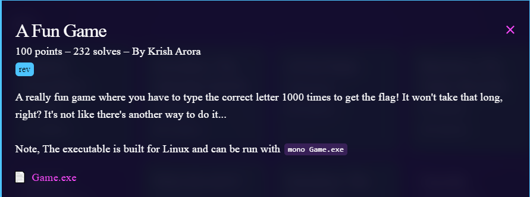
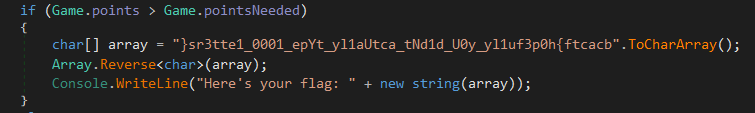

# Challenge

<p align="center">
  
</p>

# File: [Game.exe](./Game.exe)

# Solve:
 ```bash
nguyenguyen753@MochiZou:~/CTF/bcaCtf/RE/aFunGame$ file Game.exe 
Game.exe: PE32 executable (console) Intel 80386 Mono/.Net assembly, for MS Windows
```

Mình dùng dnSpy để dịch bài này

<p align="center">
  
</p>

Việc của mình là đảo ngược lại chuỗi và ta sẽ ra flag.

## script.py
```python
string = "}sr3tte1_0001_epYt_yl1aUtca_tNd1d_U0y_yl1uf3p0h{ftcacb"[::-1]
print(string)
```

`bcactf{h0p3fu1ly_y0U_d1dNt_actUa1ly_tYpe_1000_1ett3rs}`