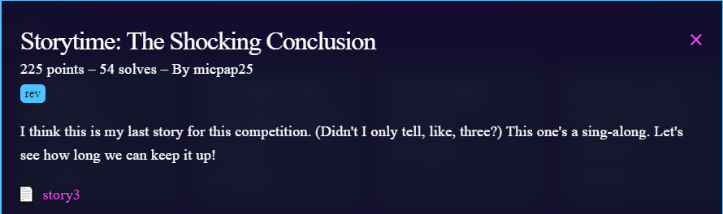
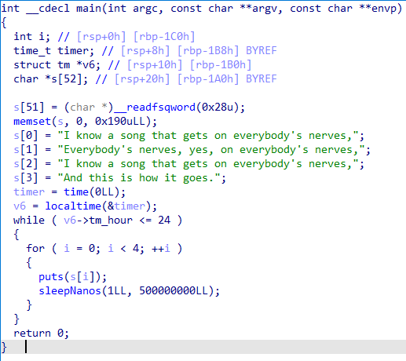
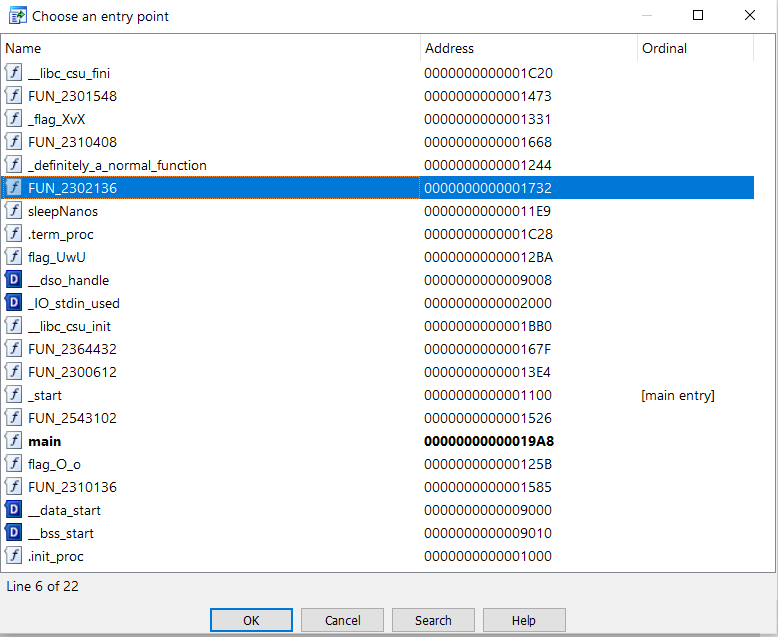
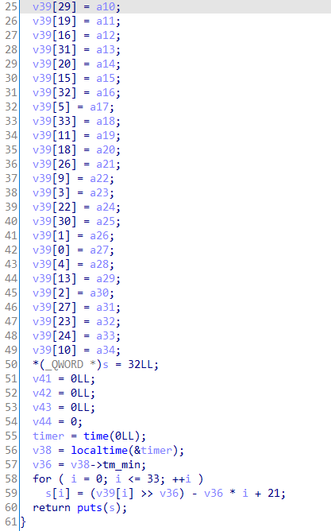
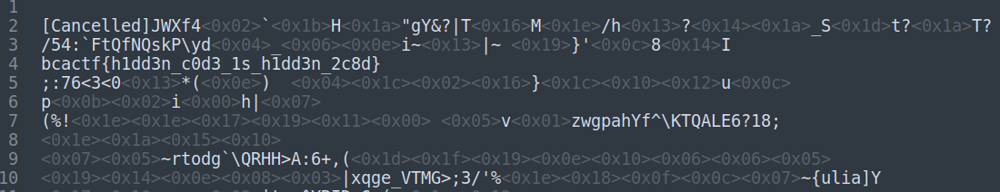

# Challenge

<p align="center">
  
</p>

# File: [story3](./story3)

# Solve:
```bash
nguyenguyen753@MochiZou:~/CTF/bcaCtf/RE/story3$ file story3 
story3: ELF 64-bit LSB shared object, x86-64, version 1 (SYSV), dynamically linked, interpreter /lib64/ld-linux-x86-64.so.2, BuildID[sha1]=5210af9f7161e4d6b1c076ac4c8a88b15055ee1a, for GNU/Linux 3.2.0, not stripped
```

Mình check thử IDA thì mình thấy có điều kì lạ:

<p align="center">
  
</p>

Không có một hàm gì liên quan đến flag cả. Lúc này mình mới nghi ngờ rằng có một hàm trong chương trình được viết nhưng không được chạy. Mình kiểm tra các `Entry points` thử:

<p align="center">
  
</p>

Mình vào thử hàm được bôi xanh, và đúng như mình dự đoán, đây có thể là flag:

<p align="center">
  
</p>

Mình dịch hàm này thử thì thấy là hàm đã truyền vào 60 tham số tương ứng với 60 kí tự trong flag. Và sau đó thực hiện phép biến đổi dựa trên số phút trên máy tính. Lúc này mình sẽ viết script để chạy từ 0 đến 59, tương ứng với số phút, và mã hoá các đoạn kí tự này lại và kiểm tra một trong số chung có là flag không:

## File input: [abc](./abc)

## script.py
```python
leak = [int(i[i.find('dd')+3:].strip()[:-1], 16) for i in open("abc").readlines()]

for num in range(0, 60):
	cou = 0
	for i in leak:
		val = ((i >> num) - num * cou + 21) & 127
		cou += 1
		print(chr(val), end = "")
	print()
```

Kiểm tra các kết quả:

<p align="center">
  
</p>

`bcactf{h1dd3n_c0d3_1s_h1dd3n_2c8d}`