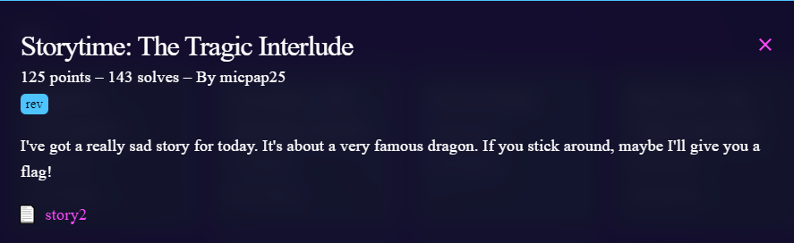
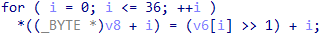

# Challenge

<p align="center">
  
</p>

# File: [story2](./story2)

# Solve:
```bash
nguyenguyen753@MochiZou:~/CTF/bcaCtf/RE/story2$ file story2 
story2: ELF 64-bit LSB shared object, x86-64, version 1 (SYSV), dynamically linked, interpreter /lib64/ld-linux-x86-64.so.2, BuildID[sha1]=1e3cbcc533556d3e4ce1edb0848a21cef1b10365, for GNU/Linux 3.2.0, not stripped
```

Bài này tuy không hiện flag, nhưng có 1 chỗ khá đáng nghi: 

<p align="center">
  
</p>

Sau đó mình viết script thử để kiểm tra

## script.py
```python
v6 = [0 for i in range(50)]

v6[36] = 179;
v6[14] = 180;
v6[6] = 235;
v6[13] = 207;
v6[3] = 193;
v6[10] = 213;
v6[30] = 154;
v6[26] = 57;
v6[15] = 73;
v6[12] = 72;
v6[20] = 64;
v6[4] = 224;
v6[5] = 194;
v6[23] = 174;
v6[29] = 55;
v6[35] = 166;
v6[8] = 192;
v6[7] = 218;
v6[33] = 151;
v6[25] = 61;
v6[17] = 157;
v6[16] = 196;
v6[28] = 182;
v6[24] = 143;
v6[2] = 191;
v6[19] = 190;
v6[21] = 165;
v6[0] = 197;
v6[32] = 34;
v6[11] = 169;
v6[31] = 137;
v6[1] = 196;
v6[18] = 165;
v6[9] = 87;
v6[22] = 52;
v6[27] = 151;
v6[34] = 126;

a = ""

for i in range(37):
	a += (chr((v6[i] >> 1) + i))

print(a)
```

`bcactf{th4t_0th3r_dr4g0n_76fw8kc1lav}`