# Challenge

<p align="center">
  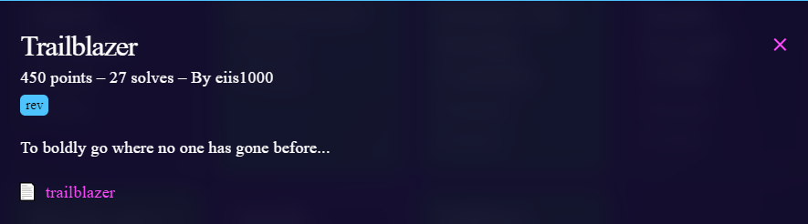
</p>

# File: [trailblazer](./trailblazer)

# Solve:
```bash
nguyenguyen753@MochiZou:~/CTF/bcaCtf/RE/trailblazer$ file trailblazer 
trailblazer: ELF 64-bit LSB executable, x86-64, version 1 (SYSV), dynamically linked, interpreter /lib64/ld-linux-x86-64.so.2, BuildID[sha1]=010143a71b685bdeff46ec988c73c1f2a752faa2, for GNU/Linux 3.2.0, not stripped
```

Vô IDA kiểm tra thử:

<p align="center">
  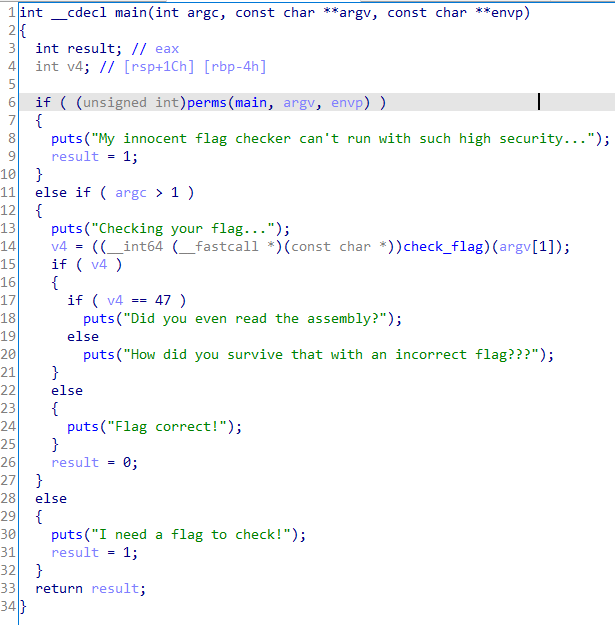
</p>

Ta thấy hàm `check_flag()` cùng với một điều kiện của `input` là độ dài của `input` phải bằng 47.
Ta xem thử hàm `check_flag()` thì hàm này không thể decompile được. Mình đành đọc assembly + debug để xem chuyện gì đã xảy ra. Thì mình có 1 vài phát hiện thú vị về hàm perms:

<p align="center">
  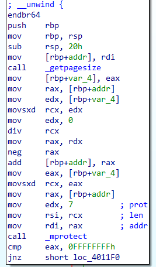
</p>

Hàm `_mprotect()` khi tra trên google:

<p align="center">
  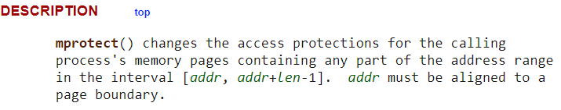
</p>

Tóm tắt ngắn gọn thì hàm này sẽ chỉnh sửa quyền truy cập của một vùng memory pages nào đó. Ở trong bài này, hàm sẽ chỉnh sửa quyền truy cập ở đoạn này:

<p align="center">
  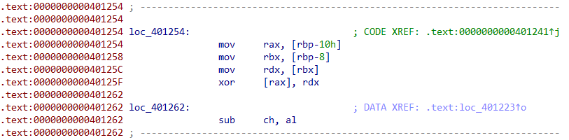
</p>

Thêm vào đó, hàm truyền vào tham số 7, nghĩa là ở đoạn code trên, ta có quyền vừa chỉnh sửa, vừa thực hiện chương trình trên đoạn code này.
Với đoạn input ở trên, ta có thể suy nghĩ rằng: flag chính là đoạn input này bởi vì từng kí tự trong input sẽ thay đổi đoạn chương trình này bằng các xor các opcodes đã có sẵn trong chương trình với input, sẽ tạo ra các instructions hợp lệ.
Lấy ví dụ ở bài này, mình sẽ bật opcodes trong IDA để có thể dễ hình dung:

<p align="center">
  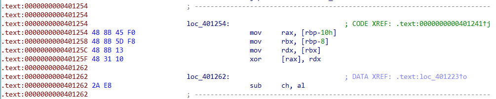
</p>

Đầu tiên, mình sẽ để input là `bcactf{aaaaaaaaaaaaaaaaaaaaaaaaaaaaaaaaaaaaaaa}`, đủ 47 kí tự, và sau đó mình debug:

<p align="center">
  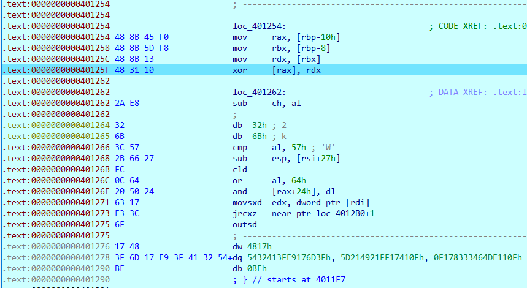
</p>

Có thể thấy rõ rằng các opcode phía sau phép `xor` đều là các opcode rác. Ta thử step next để xem chuyện gì xảy ra:

<p align="center">
  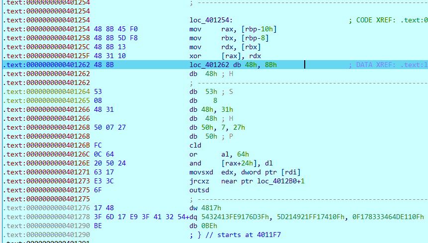
</p>

Ta sửa lại opcode để hiện rõ các instructions:

<p align="center">
  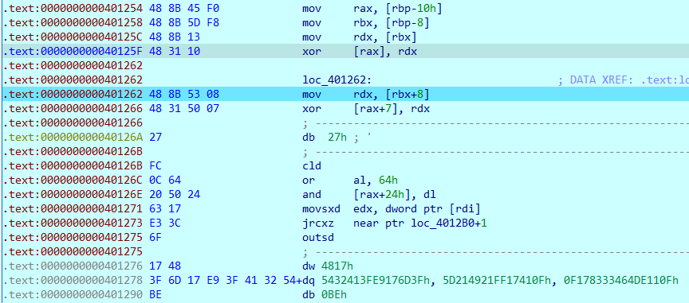
</p>

À, bây giờ mọi thứ có vẻ đã đúng hướng:  
Bởi vì ta muốn xor các input của ta với opcode rác trong đoạn chương trình đó để tạo thành các instructions hợp lệ, ta 2 instructions mới với các instructions trên thì ta thấy rằng `xor [rax+7], rdx` cần phải chuyển thành `xor [rax+8], rdx`, ta thử assemble đoạn code này thành opcode để xem opcode mình cần tìm là gì.

<p align="center">
  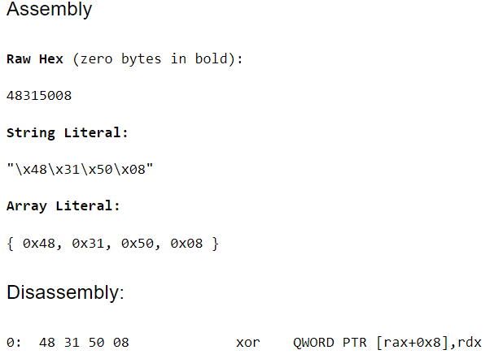
</p>

Từ đây, mình mới tìm các instructions phù hợp tiếp theo để tìm flag:

<p align="center">
  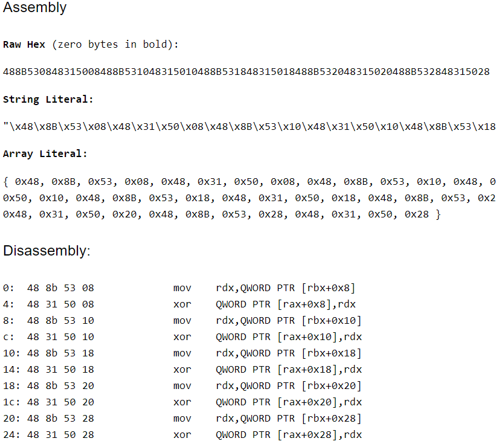
</p>

Ta sẽ thử lấy đoạn opcode này xor với các đoạn opcode rác để xem coi kết quả có phải là flag không

## script.py
``` python
opcodes =         bytes.fromhex('488B530848315008488B531048315010488B531848315018488B532048315020488B532848315028')
garbage_opcodes = bytes.fromhex('2AE8326B3C572B6627FC0C642050246317E33C6F17483F6D17E93F4132540F4117FF2149215D0F11')

from pwn import *

print(xor(opcodes, garbage_opcodes))
# Result: b'bcactf{now_thats_how_you_blaze_a_trail_9'
```

Mình còn 1 đoạn flag cuối cùng nữa, dựa vào hint của đề bài:

<p align="center">
  
</p>

Vậy những đoạn instructions cuối cùng sẽ ra return 0, sao cho opcodes phải đủ 7 bytes.  
Một hồi loanh hoanh tìm thì mình cũng có kết quả: 

<p align="center">
  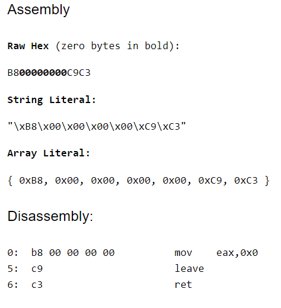
</p>

Ta viết thêm vào trong script nữa sẽ có kết quả hoàn chỉnh:

## script.py
``` python
opcodes =         bytes.fromhex('488B530848315008488B531048315010488B531848315018488B532048315020488B532848315028')
garbage_opcodes = bytes.fromhex('2AE8326B3C572B6627FC0C642050246317E33C6F17483F6D17E93F4132540F4117FF2149215D0F11')

from pwn import *

print(xor(opcodes, garbage_opcodes))
```

`bcactf{now_thats_how_you_blaze_a_trail_9fd43x8}`