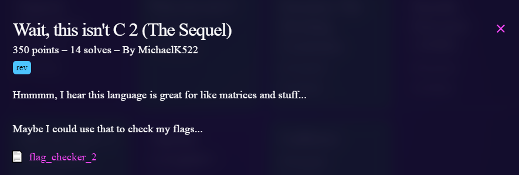
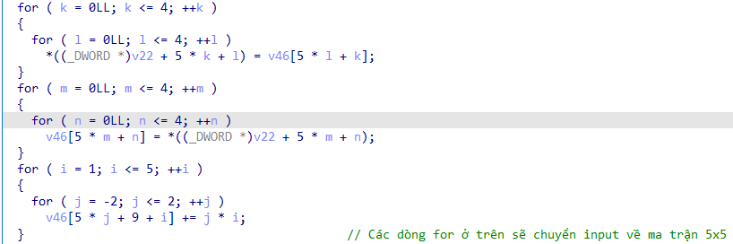
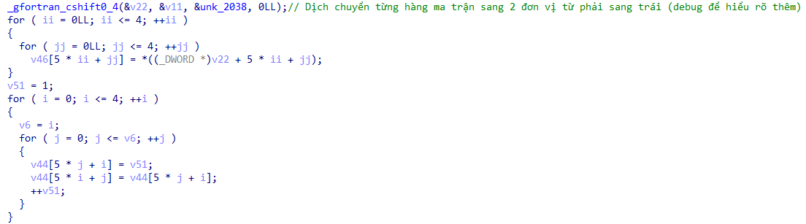
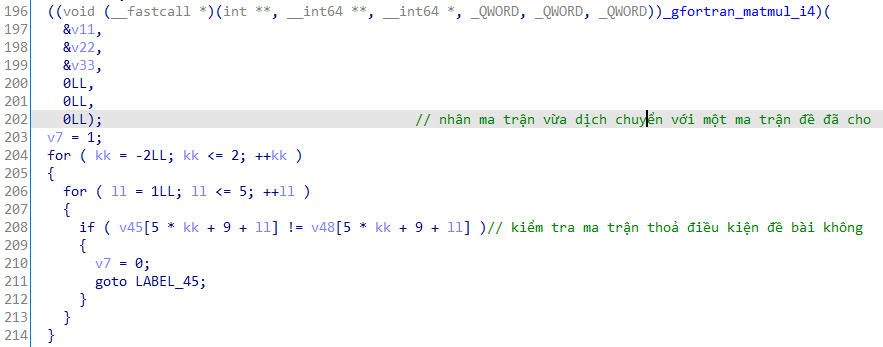

# Challenge

<p align="center">
  
</p>

# File: [flag_checker_2](./flag_checker_2)

# Solve: 

```bash
nguyenguyen753@MochiZou:~/CTF/bcaCtf/RE/waitThisIsn'tC2$ file flag_checker_2 
flag_checker_2: ELF 64-bit LSB shared object, x86-64, version 1 (SYSV), dynamically linked, interpreter /lib64/ld-linux-x86-64.so.2, BuildID[sha1]=23f8256773b016d463a1f8fd482288fa13fec173, for GNU/Linux 3.2.0, not stripped
```

Như bài trước, đây cũng được viết bằng ngôn ngữ fortran. Mình xem sơ qua thì thấy có vẻ mệt hơn bài đầu =((
Check sơ sơ thì thấy có một vài nơi thú vị, mình sẽ tóm tắt qua hình (lưu ý rằng mình sẽ không đi vào quá chi tiết những đoạn này):

<p align="center">
  
</p>

<p align="center">
  
</p>

<p align="center">
  
</p>

Bây giờ ta cần dịch ngược về input. Để ý ở đây có đoạn nhân ma trận. Gọi `F` là ma trận vừa dịch chuyển, `A` là ma trận đề cho, `F1` là kết quả, thì ta có: `A . F = F1`
Ta đã có `A` và `F1`, muốn tìm lại `F` ta sẽ có công thức: `F = (A^-1) . F1`. Và từ đó ta sẽ dịch ngược lại ra input.

## script.cpp
```cpp
#include<bits/stdc++.h>
using namespace std;

int b[10][10], f[10][10], a1[10][10], flag[10][10], k[10][10], a[10][10];

void init() {
    a[0][0] = 1;
    a[0][1] = 2;
    a[0][2] = 4;
    a[0][3] = 7;
    a[0][4] = 0xb;

    a[1][0] = 2;
    a[1][1] = 3;
    a[1][2] = 5;
    a[1][3] = 8;
    a[1][4] = 0xc;

    a[2][0] = 4;
    a[2][1] = 5;
    a[2][2] = 6;
    a[2][3] = 9;
    a[2][4] = 0xd;

    a[03][0] = 7;
    a[03][1] = 8;
    a[03][2] = 9;
    a[03][3] = 0xa;
    a[03][4] = 0xe;

    a[04][0] = 0xb;
    a[04][1] = 0xc;
    a[04][2] = 0xd;
    a[04][3] = 0xe;
    a[04][4] = 0xf;

    flag[0][0] = 0xac0;
    flag[0][1] = 0x779;
    flag[0][2] = 0xa43;
    flag[0][3] = 0x859;
    flag[0][4] = 0x982;

    flag[1][0] = 0xcda;
    flag[1][1] = 0x92c;
    flag[1][2] = 0xc10;
    flag[1][3] = 0x9d5;
    flag[1][4] = 0xb5e;

    flag[2][0] = 0xfc9;
    flag[2][1] = 0xba1;
    flag[2][2] = 0xe65;
    flag[2][3] = 0xbc2;
    flag[2][4] = 0xdfc;

    flag[03][0] = 0x1465;
    flag[03][1] = 0xf9e;
    flag[03][2] = 0x120c;
    flag[03][3] = 0xf08;
    flag[03][4] = 0x1200;

    flag[04][0] = 0x1b6e;
    flag[04][1] = 0x15c2;
    flag[04][2] = 0x17de;
    flag[04][3] = 0x13d5;
    flag[04][4] = 0x183b;
}

void mulMatrix() {
    memset(k, 0, sizeof(k));
    for (int i=0; i<5; i++)
        for (int j=0; j<5; j++) {
            for (int num=0; num<5; num++)
                k[i][j] += (float)a[i][num] * f[num][j];
        }
}

void encryption() {
    string s;
    cin >> s;
    int num = 0;

    for (int i=0; i<5; i++)
        for (int j=0; j<5; j++) {

            if (i + j != 0)
                b[i][j] = (int)s[num];
            num++;
        }

    for (int i = 1; i <= 5; ++i ) {
        for (int j = -2; j <= 2; ++j )
            b[j + 2][i - 1] += j * i;
    }

    for (int i=0; i<5; i++)
        for (int j=0; j<5; j++) {
            f[i][j] = b[i][(j + 2) % 5];
        }

    mulMatrix()

    for (int i=0; i<5; i++) {
        for (int j=0; j<5; j++)
            cout << k[i][j] << " ";
        cout << endl;
    }
    cout << endl;
}

int main(){
    init();

    /*
    here is the input of a[][] array:
    93 89 89 0 94
    120 105 47 115 100
    108 99 101 116 82
    100 86 106 54 97
    117 56 118 97 103
    */

    for (int i=0; i<5; i++)
        for (int j=0; j<5; j++)
            cin >> a[i][j];


    for (int i=0; i<5; i++)
        for (int j=0; j<5; j++) {
            int num = 0;
            if (j - 2 < 0) num = j + 3;
                else num = j - 2;
            flag[i][j] = a[i][num];
        }

    for (int i = 1; i <= 5; ++i ) {
        for (int j = -2; j <= 2; ++j )
            flag[j + 2][i - 1] -= j * i;
    }

    for (int i=0; i<5; i++) {
        for (int j=0; j<5; j++)
            cout << (char)flag[i][j];
    }
    cout << endl;
}
```

`bcactf{m4tRlce5_aRe_co0l}`