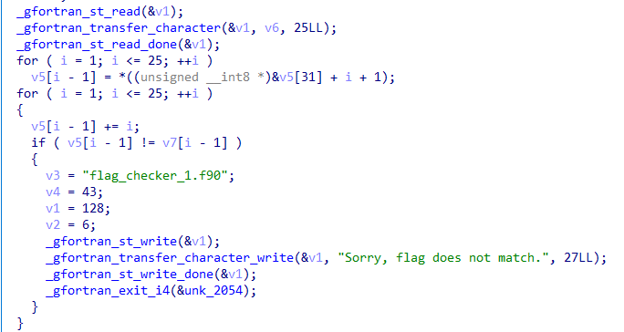

# Challenge

<p align="center">
  
</p>

# File: [flag_checker_1](./flag_checker_1)

# Solve:

```bash
nguyenguyen753@MochiZou:~/CTF/bcaCtf/RE/waitThisIsn'tC$ file flag_checker_1 
flag_checker_1: ELF 64-bit LSB shared object, x86-64, version 1 (SYSV), dynamically linked, interpreter /lib64/ld-linux-x86-64.so.2, BuildID[sha1]=44db315a94752488b3ace72816fef8393c9db3fd, for GNU/Linux 3.2.0, not stripped
```

Sau khi bỏ vào IDA thì mình nhận ra đây là ngôn ngữ Fortran, trước giờ chưa reverse nên mình vừa làm bài này vừa đọc tài liệu tham khảo.  
Trong quá trình làm, mình thấy có đoạn này là đoạn chính:

<p align="center">
  
</p>

Một hồi debug thì mình hiểu rằng chương trình đã kiểm tra bằng cách tại vị trí `i`, kí tự thứ `i - 1` được cộng lên `i` đơn vị. Vậy là mình viết script để giải bài này

## File input: [abc](./abc)
## script.py
```python
leak = [int(i[i.find('db') + 3:].strip()[:-1], 16) for i in open("abc").readlines() if i[i.find('db') + 3:].strip() != '0']

for i in range(len(leak)):
	leak[i] -= (i + 1)
	print(chr(leak[i]), end = "")
```

`bcactf{f0rtr4N_i5_c0oO0l}`