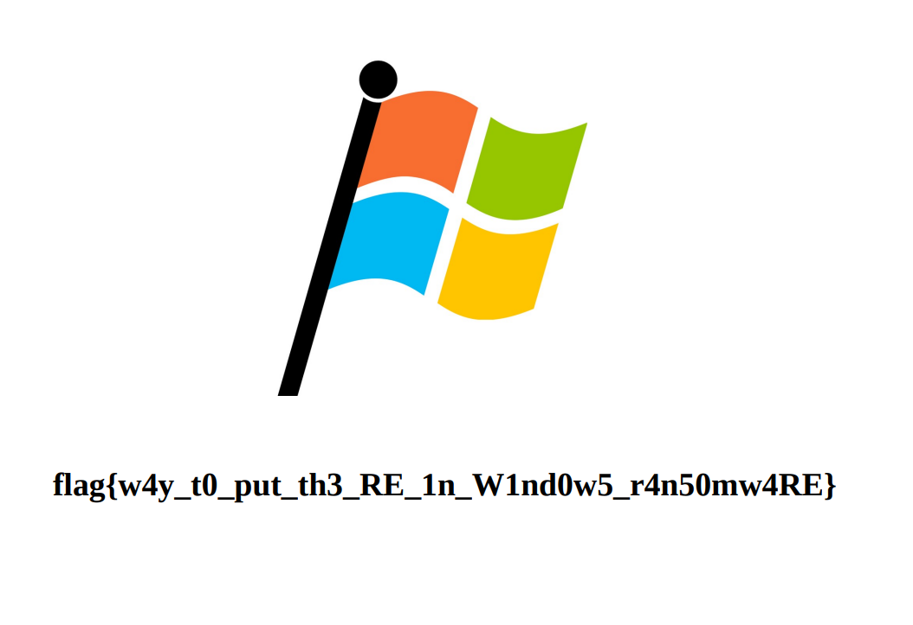

# Challenge

# File: [ransomwaRE.exe](./ransomwaRE.exe) [files.zip](./files.zip)

# Solve:

```c
GetSystemTime(&SystemTime);
  *(_DWORD *)pbData = SystemTime.wDayOfWeek;
  v3 = 16i64;
  v13 = SystemTime.wMonth;
  v14 = SystemTime.wYear;
  v15 = SystemTime.wDay;
  pdwDataLen = 16;
  phProv = 0i64;
  phHash = 0i64;
  if ( !CryptAcquireContextW(&phProv, 0i64, 0i64, 1u, 0xF0000000) )
    goto LABEL_19;
  if ( !CryptCreateHash(phProv, 0x8003u, 0i64, 0, &phHash) )
  {
    CryptReleaseContext(phProv, 0);
    exit(1);
  }
  if ( !CryptHashData(phHash, pbData, 0x10u, 0) )
  {
    CryptDestroyHash(phHash);
    CryptReleaseContext(phProv, 0);
    exit(1);
  }
  if ( !CryptGetHashParam(phHash, 2u, &v16, &pdwDataLen, 0) )
LABEL_19:
    exit(1);
  v4 = &MultiByteStr;
  v18 = 0;
  v5 = &v16;
  do
  {
    sub_7FF75E821340(v4, "%02x", *v5);
    v4 += 2;
    ++v5;
    --v3;
  }
  while ( v3 );
  v6 = (WCHAR *)sub_7FF75E8262E0(66i64);
  MultiByteToWideChar(0, 0, &MultiByteStr, -1, v6, 33);
  if ( phHash )
    CryptDestroyHash(phHash);
  if ( phProv )
    CryptReleaseContext(phProv, 0);
  sub_7FF75E821E10(v6);
  return 0;
```

Nhìn vào hàm main, ta hiểu sơ là hàm sẽ lấy thời gian hiện tại trên máy tính, tạo mã md5 dựa trên thời gian đó rồi sau đó bước vào hàm `sub_7FF75E821E10()`.
TớI đây, mình sẽ thấy file ransomware sẽ kết nối với một server nào đó. Đồng thời thấy server gửi key là mã md5 được tính trước đó, nhưng sau đó server không trả gì về cho chúng ta cả. Đọc lại description thì thấy ransomware bắt đầu lúc ngày 11 tháng 7. Nhanh trí chỉnh thời gian của máy về ngày 11 tháng 7 rồi chạy lại ransomware để kết nối server.
Debug một hồi thì thấy server nhả về file **sys_proc.txt**, chúng ta nhìn sơ thì thấy nó là một file PE, nên bỏ vào IDA xem tiếp.

Xem một hồi thì biết file này thực hiện các quá trình sau:
  * Tạo ra một ID user, cùng với tạo ra `key` và `iv` cho việc mã hoá các file.
  * Gửi ID user lên server.
  * Encrypt files

Đọc sơ qua phần mã hoá file thì thấy hàm sử dụng thuật toán `AES 128 bits CTR`. Lúc này hỏi tay to crypto cách giải mã thì ta sẽ lấy 1 file gốc xor với file gốc đó sau khi bị mã hoá, rồi lấy kết quả vừa xor đó đi xor với những file bị mã hoá khác để giải mã file đó. Xem script viết kèm theo để hiểu rõ:

```python
f1 = open("./2020_IC3Report.pdf", "rb").read()
f2 = open("./cad0b75505847a4792a67bb33ece21ec9c7bd21395ca6b158095d92772e01637.pdf.cryptastic", "rb").read()
c = []
for i in range(len(f1)):
    c.append(f1[i] ^ f2[i])

f = open("./ea6b505ffded681a256232ed214d4c3b410c8b4f052775eb7e67dcbd5af64e63.pdf.cryptastic", "rb").read()
k = open("./log.txt", "wb")
for i in range(len(f)):
    k.write(bytes([f[i] ^ c[i]]))
k.close()
```

<p align="center">
  
</p>