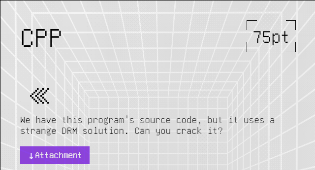
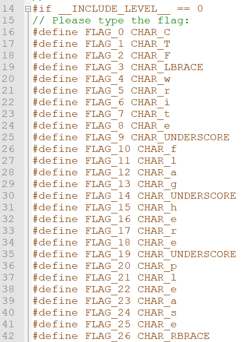
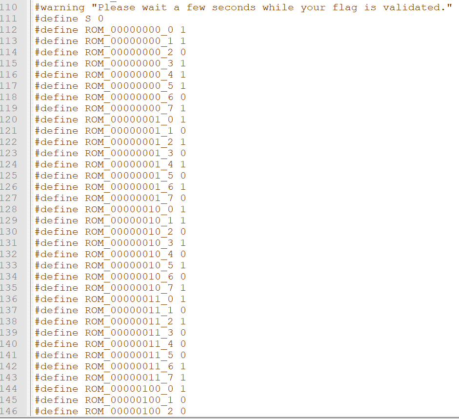
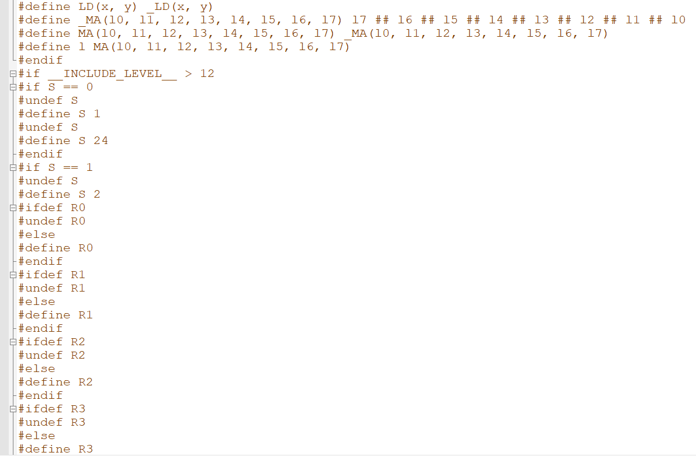
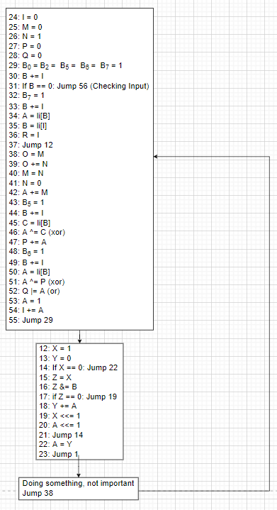
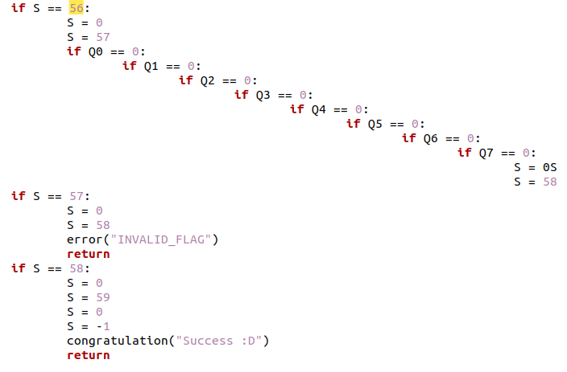
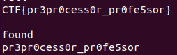

# Challenge

  

# File: [cpp.c](./cpp.c)

# Solve:
Mở file `cpp.c` thì thấy một đóng code loằng ngoằng ở phía trên hàm main, một hồi tra Google thì biết được đây gọi là preprocessor (Tài liệu tham khảo: [https://www.geeksforgeeks.org/preprocessor-works-c/](https://www.geeksforgeeks.org/preprocessor-works-c/))  
Tóm tắt lại thè preprocessor là một phần trong chương trình C trước khi đưa vào compiler, nó sẽ chạy trước.  
Mình thấy có vẻ như không debug được nên mình đã xem sơ qua chương trình thực hiện gì thì mình thấy có 3 phần chính:  
  * Phần input: 

  

	
  * Phần khởi tạo trước khi chạy vào phần chính:
	

  

  * Và tất nhiên, phần cuối cùng là phần xử lí chính:
  

  

Thấy một đống code thế này, chắc chắn không thể RE lại được. Nhưng có một điều của preprocessor là các câu lệnh vô cùng ngắn gọn. Cho nên ta có thể viết một cái interpreter biến preprocessor của C thành ngôn ngữ python. Mình có đính kèm file [vm_parse.py](./vm_parse.py) để mọi người tham khảo.  
Và cùng với mốt chút chỉnh sửa file, thì đây là kết quả của mình được đính kèm trong file [script.py](./script.py) (chương trình chính nằm trong hàm `bruteforce()`, và đây cũng là script mình dùng để giải bài này)  
Ngồi RE được một khoảng thời gian thì mình thấy có vẻ đây là một bài Virtual Machine. Mình vẽ một cái Graph để mô tả lại chương trình (lưu ý: mảng `li[]` trong chương trình là các biến `ROM` trong file gốc:  

  

Mình xem opcode 56 trong chương trình:

  

Oke, vậy là đã quá rõ ràng rồi, nhiệm vụ của chúng ta là phải làm cho Q = 0.  
Bài này ta có 2 cách để giải, 1 là ta sẽ dịch ngược lại đoạn code trên để cho ra input, 2 là bruteforce.
Tại sao lại bruteforce? Trong đoạn code, Q đóng vai trò trong opcode 52: `Q |= A`. Hay nói cách khác, Khi ta nhập Input, nó sẽ kiểm tra từng kí tự, nếu như tới kí tự thứ `i` bị sai thì Q lập tức sẽ khác 0.  
Với tính chất trên, ta hoàn toàn có thể bruteforce từng kí tự trong vòng vài giây.  
Sau khi chạy file `script.py` thì mình cho ra kết quả:

  

	
`CTF{pr3pr0cess0r_pr0fe5sor}`