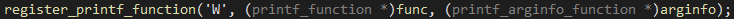

# Challenge

<p align="center">
  
</p>

# File: [weather](./weather)

# Disclaimer:
Bài này lúc thi mình không giải ra, vì lúc đầu mình đã có một vài nhận xét sai nên nghĩ rằng không làm được. Nhưng trước khi kết thúc kì thi khoảng 6 tiếng thì mình có xem lại bài và phát hiện là những nhận xét của mình có phần sai sót. Sau khi đánh giải lại thì mình thấy mình có thể làm được bài này, nhưng không còn thời gian để giải trong lúc thi nữa. Bài này mình giải được sau khi thi 2 ngày, nhưng mình khá tự hào vì đã tự giải quyết nó mà không có sự trợ giúp từ bên ngoài.

# Solve:
Bài này đòi hỏi một vài kiến thức khá mới lạ so với những WriteUp trước đó mình viết, nên mình sẽ nói về những kiến thức đó trong bài này:

## Hàm init
Nếu như chúng ta để ý hàm `__libc_start_main()` thì ngoài trừ tham số là hàm `main`, còn có một hàm đáng được quan tâm là hàm `init`.  
Hàm `init` là một constructor trước khi vô hàm `main`. Hay nói nôm na dễ hiểu là hàm `init` sẽ được chạy đầu tiên rồi sau đó mới đến hàm `main`.  
Như vậy chuyện tác giả có thể giấu code trong hàm `init` là một điều hoàn toàn khả thi. Và trong bài này tác giả đã làm như thế. Ta thử xem sơ qua hàm `init`:

<p align="center">
  
</p>

Đây là một câu trúc chung của hàm `init` trong các chương trình ELF. Trong hình ta thấy có biến `funcs_2701`. Đó là biến con trỏ, sẽ trỏ tới các chương trình con nó sẽ gọi để khởi tạo chương trình. Ta vô xem thử thì thấy có 2 chương trình con:

<p align="center">
  
</p>

Thường thì chương trình đầu tiên là của hệ thống nên ta không quan tâm. Nhưng chương trình con thứ 2 (nếu xuất hiện) thường sẽ là của tác giả, nên ta vô xem hàm này:

<p align="center">
  
</p>

Và ... có một đống hàm `register_printf_function`...

## Custom printf
Hàm printf được dùng để xuất kết quả ra chương trình, tuy nhiên hàm đòi hỏi một tham số khá quan trọng, đó là tham số `format`, mính sẽ không nói chi tiết printf hoạt động như thế nào, các bạn có thể lên google tra thử.  
Thì như tiêu đề, tham số `format` hoàn toàn có thể custom được, hay nói cách khác, ta có thể tạo ra một (`format`) mới theo ý của riêng ta.  
Để giúp đỡ chúng ta trong việc tạo `format` mới, hàm `register_printf_function` được ra đời. Lên mạng đọc về hàm này thì mình sẽ tóm tắt lại một số điều quan trọng của hàm như sau:
  * Hàm truyền vào 3 tham số.
  * Tham số đầu tiền là `format` mình muốn sử dụng. Ví dụng `format` mình muốn dùng là `Y` thì ta có thể `printf('%Y')`
  * Tham số thứ hai là con trỏ trỏ đến chương trình sẽ được xử lí khi gọi `format`.
Mình ví dụ:

<p align="center">
  
</p>

Ở hàm này, nếu như mình thực hiện lệnh `printf('%W');` thì hàm `func` sẽ được gọi để xử lí chương trình.
Chi tiết các bạn có thể tham khảo ở [https://www.gnu.org/software/libc/manual/html_node/Registering-New-Conversions.html](https://www.gnu.org/software/libc/manual/html_node/Registering-New-Conversions.html)

Ok, giờ là chương trình chính:

<p align="center">
  
</p>

<p align="center">
  
</p>

Mình để ý ngay đến dòng cuối, nó sẽ in ra flag tuỳ vào input ta nhập. Mình xem thử hàm xử lí foramt `%F`

<p align="center">
  
</p>

Nó sẽ gọi cho `%C`, ta xem tiếp `%C` nó làm gì:

<p align="center">
  
</p>

Hmmmmmm, nhìn khá phức tạp. Nếu như tham khảo tài liệu kĩ hơn thì ta sẽ hiểu ngoài format ra ta còn có những tham số truyền vào format, ví dụ như `%+12.45llF`. Ở đây có 4 phần: Dấu `+`, số `12`, số `45` và kí hiệu `ll`  
Những phần này sẽ quyết định các tham số và 'opcode' của chương trình. Đúng vậy, đây là một bài Virtual Machine.
Lúc này mình debug để hiểu thêm và phát hiện có 3 phase chính:  
  * Phase 1: Magic byte. Ở đây nếu như kí tự đầu tiên không đúng với magic byte thì chương trình sẽ lập tức kết thúc. Một hồi debug thì Magic byte = `T`
  * Phase 2: Init: chương trình sẽ chuẩn bị một vài tham số để thực hiện Phase 3.
  * Phase 3: Encrypt Input. Từ tham số được chuẩn bị ở phase 2, chương trình sẽ encrypt input và so sánh kết quả sau khi encrypt. Nếu như so sánh không khớp thì kết quả trả về là `nope`, còn nếu đúng thì chương trình trả về flag

Bài này mình có viết script để dịch opcode cho dễ hiểu, nhưng script mình viết chỉ có một mình bản thân mình hiểu nên mình không dám đưa script lên :p, tuy nhiên script không quá khó, các bạn có thể debug để hiểu thêm và viết script cho bản thân.  
Mình đã nhảy sang Phase 3 để mình tìm các tham số và viết một chương trình để decrypt lại tìm input phù hợp:

## script.py
```python
li = [161, 51, 163, 51, 173, 51, 185, 51, 193, 51, 203, 51, 211, 51, 235, 51, 241, 51, 253, 51, 1, 52, 15, 52, 19, 52, 25, 52, 27, 52, 55, 52, 69, 52, 85, 52, 87, 52, 99, 52, 105, 52, 109, 52, 129, 52, 139, 52, 145, 52, 151, 52, 157, 52, 165, 52, 175, 52, 187, 52, 201, 52, 211, 52, 225, 52, 241, 52, 255, 52, 9, 53, 23, 53, 29, 53]
char = [0xf5, 0xcc, 0xcf, 0xf9, 0xa9, 0xc4, 0xa5, 0x8a, 0xa3, 0xa0, 0x57, 0x6f, 0x88, 0x86, 0x79, 0x79, 0x48, 0x15, 0x53, 0xd, 0x31, 0x28, 0xf6, 0xe6, 0x15, 0x2, 0x68, 0xe8]

import string

for i in range(len(char)):
	e = li[i * 2]
	cou = 0

	if (i != 0):
		num = i + 1
		cou = 0

		while (num != 1):
			cou += 1
			if (num % 2 == 0): num //= 2
			else: num = (num * 3) + 1

	val = (char[i] - cou) & 255
	val ^= e
	print(chr(val), end = "")
print()
```

<p align="center">
  
</p>

Đưa kết quả vào chương trình:

<p align="center">
  
</p>

`CTF{curs3d_r3curs1ve_pr1ntf}`