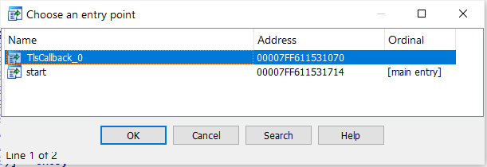
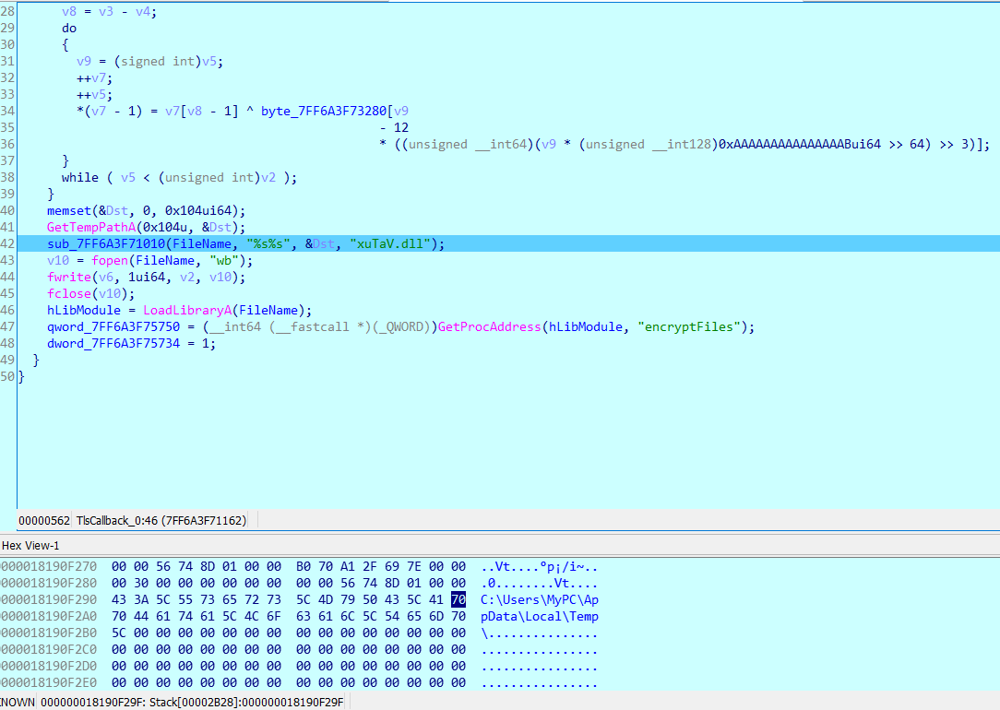
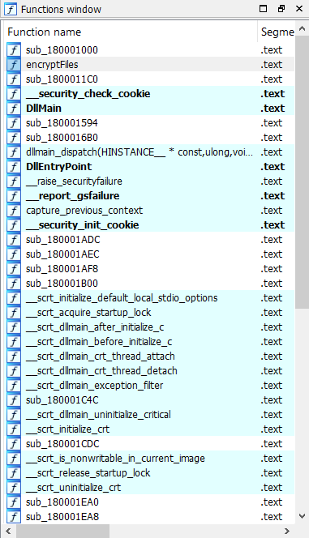
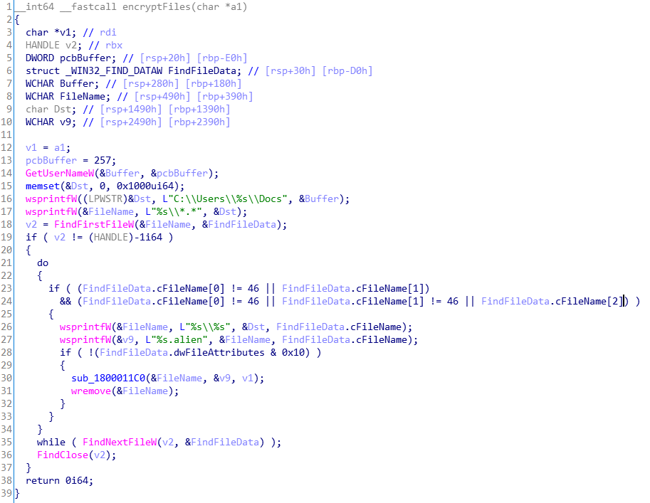
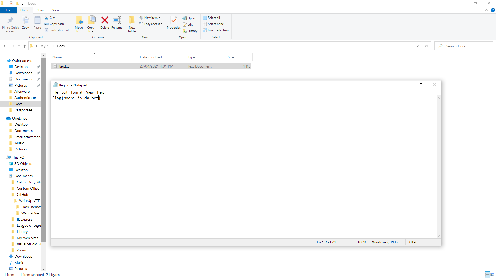
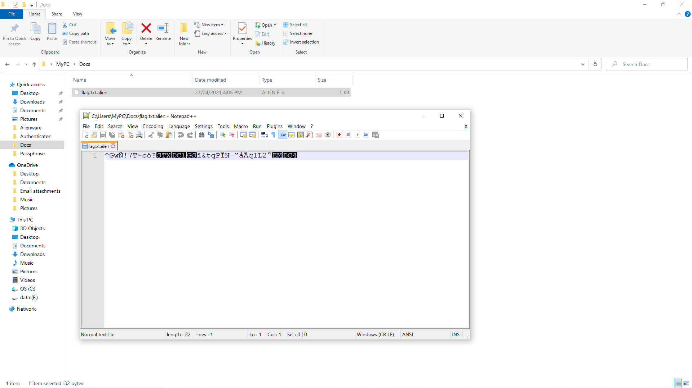
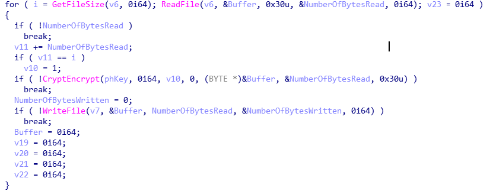
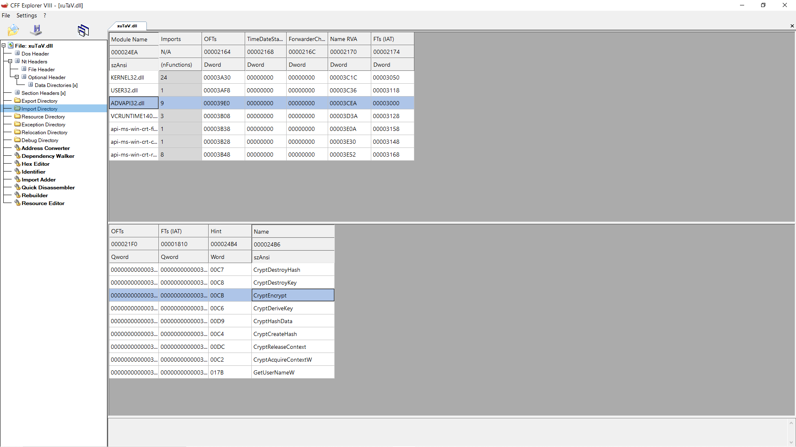
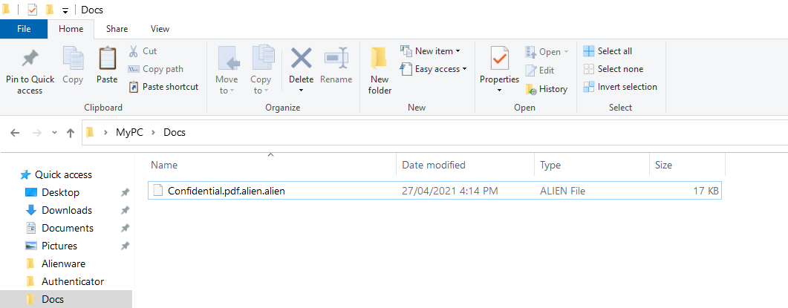
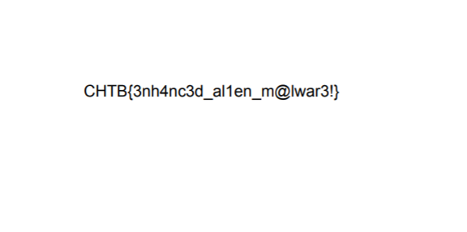

# Challenge

[alienware folder](https://drive.google.com/drive/folders/1tTqaWqBSvOHp2kw4qwjw7Ciw80CZxMEY?usp=sharing)

# Solution

Đây là một file PE, nên ta sẽ bỏ thẳng vô IDA để chạy:

<p align="center">
  
</p>

Ta nhận thấy rằng có `TlsCallback`, có thể hiểu rằng khi chạy chương trình, trước khi vô hàm main thì chương trình bao giờ cũng sẽ chạy các hàm `TlsCallback` trước, sau đó mới vô hàm main. Ta sẽ xem thử `TlsCallback` này.

```C++
void TlsCallback_0()
{
  HRSRC v0; // rbx
  HGLOBAL v1; // rdi
  size_t v2; // rsi
  _BYTE *v3; // rbx
  char *v4; // rax
  unsigned int v5; // er9
  const void *v6; // rdi
  char *v7; // rcx
  signed __int64 v8; // rbx
  unsigned __int64 v9; // r8
  FILE *v10; // rbx
  char Dst; // [rsp+20h] [rbp-128h]

  if ( dword_7FF611535734 != 1 )
  {
    v0 = FindResourceW(0i64, (LPCWSTR)0x66, L"BIN");
    v1 = LoadResource(0i64, v0);
    v2 = SizeofResource(0i64, v0);
    v3 = LockResource(v1);
    v4 = (char *)VirtualAlloc(0i64, (unsigned int)v2, 0x1000u, 4u);
    v5 = 0;
    v6 = v4;
    if ( (_DWORD)v2 )
    {
      v7 = v4;
      v8 = v3 - v4;
      do
      {
        v9 = (signed int)v5;
        ++v7;
        ++v5;
        *(v7 - 1) = v7[v8 - 1] ^ byte_7FF611533280[v9
                                                 - 12
                                                 * ((unsigned __int64)(v9 * (unsigned __int128)0xAAAAAAAAAAAAAAABui64 >> 64) >> 3)];
      }
      while ( v5 < (unsigned int)v2 );
    }
    memset(&Dst, 0, 0x104ui64);
    GetTempPathA(0x104u, &Dst);
    sub_7FF611531010(FileName, "%s%s", &Dst, "xuTaV.dll");
    v10 = fopen(FileName, "wb");
    fwrite(v6, 1ui64, v2, v10);
    fclose(v10);
    hLibModule = LoadLibraryA(FileName);
    qword_7FF611535750 = (__int64 (__fastcall *)(_QWORD))GetProcAddress(hLibModule, "encryptFiles");
    dword_7FF611535734 = 1;
  }
}
```

Mình sẽ không đi vào chi tiết từng đoạn, nhưng sẽ tóm tắt hàm này:  
Hàm sẽ tạo ra một file tên `xuTaV.dll`, sau đó viết gì đó vào file vừa tạo, rồi chạy một hàm tên là `encryptFiles` trong file đó, sau khi đã thực hiện xong hàm đó, chương trình sẽ xoá file `xuTaV.dll`.

<p align="center">
  
</p>

Ta sẽ lần theo path nó tạo file `xuTaV.dll` và copy ra thư mục khác.  
Sau khi có file `xuTaV.dll`, ta debug và tìm hàm `encryptFiles`:

<p align="center">
  
</p>

Ta thấy có hàm `encryptFiles`, ta thử xem qua chương trình:

<p align="center">
  
</p>

Tóm tắt phần chương trình sau: Chương trình sẽ dò các file trong folder Docs, cụ thể là trong đường dẫn `C:\Users\MyPC\Docs` trên máy tính của tôi. Sau đó chương trình sẽ dò các file trong folder Docs và mã hoá các file đó.  

Ta thử tạo một file trong folder và xem thử những gì được nói ở trên có đúng không:

<p align="center">
  
</p>

Sau khi chạy chương trình:

<p align="center">
  
</p>

Hàm `sub_1800011C0()` là hàm ta cần chú tâm tới, vì nó là hàm đã mã hoá các file trong folder Docs, đồng thời thêm vào đuôi `.alien`. Ta sẽ xem qua hàm:

```C++
__int64 __fastcall sub_1800011C0(LPCWSTR lpFileName, LPCWSTR a2, char *Source)
{
  const WCHAR *v3; // rbx
  const WCHAR *v4; // rdi
  int v5; // er15
  HANDLE v6; // r14
  HANDLE v7; // rsi
  DWORD v8; // ebx
  BOOL v10; // ebx
  int v11; // edi
  DWORD i; // er15
  DWORD NumberOfBytesRead; // [rsp+40h] [rbp-C0h]
  HCRYPTPROV phProv; // [rsp+48h] [rbp-B8h]
  DWORD NumberOfBytesWritten; // [rsp+50h] [rbp-B0h]
  HCRYPTHASH phHash; // [rsp+58h] [rbp-A8h]
  HCRYPTKEY phKey; // [rsp+60h] [rbp-A0h]
  __int64 Buffer; // [rsp+68h] [rbp-98h]
  __int64 v19; // [rsp+70h] [rbp-90h]
  __int64 v20; // [rsp+78h] [rbp-88h]
  __int64 v21; // [rsp+80h] [rbp-80h]
  __int64 v22; // [rsp+88h] [rbp-78h]
  __int64 v23; // [rsp+90h] [rbp-70h]
  wchar_t Dest[4]; // [rsp+98h] [rbp-68h]
  __int64 v25; // [rsp+A0h] [rbp-60h]
  __int64 v26; // [rsp+A8h] [rbp-58h]
  __int64 v27; // [rsp+B0h] [rbp-50h]
  __int16 v28; // [rsp+B8h] [rbp-48h]
  WCHAR szProvider[8]; // [rsp+C0h] [rbp-40h]
  __int128 v30; // [rsp+D0h] [rbp-30h]
  __int128 v31; // [rsp+E0h] [rbp-20h]
  __int128 v32; // [rsp+F0h] [rbp-10h]
  __int128 v33; // [rsp+100h] [rbp+0h]
  __int128 v34; // [rsp+110h] [rbp+10h]
  __int64 v35; // [rsp+120h] [rbp+20h]
  int v36; // [rsp+128h] [rbp+28h]

  v3 = lpFileName;
  v4 = a2;
  *(_QWORD *)Dest = 0i64;
  v25 = 0i64;
  v26 = 0i64;
  v27 = 0i64;
  v28 = 0;
  mbstowcs(Dest, Source, 0x10ui64);
  v5 = lstrlenW(Dest);
  v6 = CreateFileW(v3, 0x80000000, 1u, 0i64, 3u, 0x8000000u, 0i64);
  if ( v6 == (HANDLE)-1i64 )
    return 0xFFFFFFFFi64;
  v7 = CreateFileW(v4, 0x40000000u, 0, 0i64, 2u, 0x80u, 0i64);
  if ( v7 == (HANDLE)-1i64 )
    return 0xFFFFFFFFi64;
  *(_OWORD *)szProvider = xmmword_180003290;
  v31 = xmmword_1800032B0;
  v30 = xmmword_1800032A0;
  v33 = xmmword_1800032D0;
  v32 = xmmword_1800032C0;
  v35 = 28429402151387254i64;
  v34 = xmmword_1800032E0;
  v36 = 114;
  if ( !CryptAcquireContextW(&phProv, 0i64, szProvider, 0x18u, 0xF0000000)
    || !CryptCreateHash(phProv, 0x800Cu, 0i64, 0, &phHash) )
  {
    goto LABEL_21;
  }
  if ( !CryptHashData(phHash, (const BYTE *)Dest, v5, 0) )
  {
    GetLastError();
    return 0xFFFFFFFFi64;
  }
  if ( !CryptDeriveKey(phProv, 0x660Eu, phHash, 0, &phKey) )
  {
LABEL_21:
    v8 = GetLastError();
    CryptReleaseContext(phProv, 0);
    return v8;
  }
  NumberOfBytesRead = 0;
  Buffer = 0i64;
  v19 = 0i64;
  v20 = 0i64;
  v10 = 0;
  v21 = 0i64;
  v11 = 0;
  v22 = 0i64;
  v23 = 0i64;
  for ( i = GetFileSize(v6, 0i64); ReadFile(v6, &Buffer, 0x30u, &NumberOfBytesRead, 0i64); v23 = 0i64 )
  {
    if ( !NumberOfBytesRead )
      break;
    v11 += NumberOfBytesRead;
    if ( v11 == i )
      v10 = 1;
    if ( !CryptEncrypt(phKey, 0i64, v10, 0, (BYTE *)&Buffer, &NumberOfBytesRead, 0x30u) )
      break;
    NumberOfBytesWritten = 0;
    if ( !WriteFile(v7, &Buffer, NumberOfBytesRead, &NumberOfBytesWritten, 0i64) )
      break;
    Buffer = 0i64;
    v19 = 0i64;
    v20 = 0i64;
    v21 = 0i64;
    v22 = 0i64;
  }
  CryptReleaseContext(phProv, 0);
  CryptDestroyKey(phKey);
  CryptDestroyHash(phHash);
  CloseHandle(v6);
  CloseHandle(v7);
  return 1i64;
}
```

<p align="center">
  
</p>

Đây là bước tìm hiểu trên Google. Khi đã tìm hiểu kĩ trên Google, mình có thể rút ra được một vài thứ sau:
  - Hàm `CryptEncrypt` là hàm mã hoá theo AES
  - Các hàm `Crypt` các bạn thấy trong hàm đều xuất phát từ module `Advapi32.dll`
  - Và đặc biệt, trong module `Advapi32.dll` có hàm `CryptDecrypt`  

Từ những điều trên, ta sẽ tìm cách thay hàm `CryptEncrypt` thành hàm `CryptDecrypt`, sau đó cho flie `Confidential.pdf.alien` vào folder `Docs`, thì ta sẽ có được flag.  
Ta thay đổi tên hàm `CryptEncrypt` thành hàm `CryptDecrypt` bằng `CFF Explorer`

<p align="center">
  
</p>

<p align="center">
  
</p>

Nhìn vô folder `Docs`:

<p align="center">
  
</p>

Bỏ các đuôi file `.alien` và mở file lên:

<p align="center">
  
</p>

`CHTB{3nh4nc3d_al1en_m@lwar3!}`