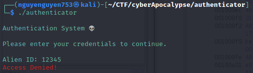
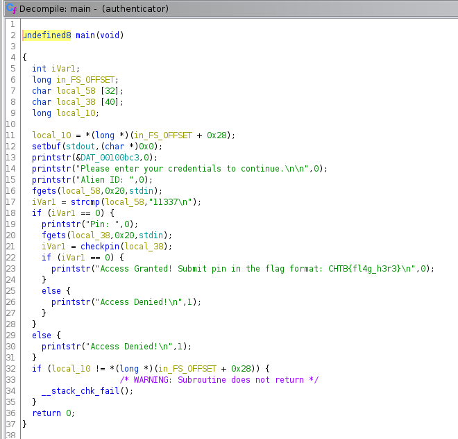
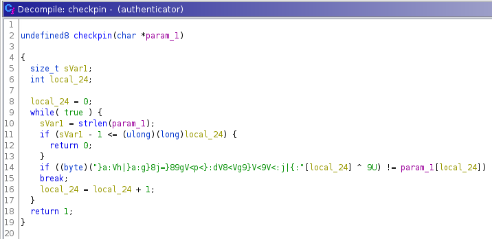

# Challenge (Do mình viết WU khá muộn nên mình không có đề bài, nhưng mình có lưu giữ file)

[authenticator](https://drive.google.com/file/d/1J4nN57KxGjGxWfHdN22SdPTiRyJPxKMy/view?usp=sharing)

# Solution

```bash
$ file authenticator 
authenticator: ELF 64-bit LSB pie executable, x86-64, version 1 (SYSV), dynamically linked, interpreter /lib64/ld-linux-x86-64.so.2, for GNU/Linux 3.2.0, BuildID[sha1]=66286657ca5a06147189b419238b2971b11c72db, not stripped
```

Chạy thử chương trình:



Ta cho vào ghidra để xem thử đoạn chương trình này:



Nhìn sơ, ta có thể hiểu được rằng có 2 lớp kiểm tra, thứ nhất là nhập ID, thứ hai là nhập Pin. Ta cũng biết rằng `ID = 11337`, còn mã Pin được check trong hàm `checkpin()`, ta xem thử hàm `checkpin()`:



Từ đây, ta viết script để tìm flag:

```python
strings = '}a:Vh|}a:g}8j=}89gV<p<}:dV8<Vg9}V<9V<:j|{:'
flag = [chr(ord(i) ^ 9) for i in strings]

print(''.join(flag))
```

`CHTB{th3_auth3nt1c4t10n_5y5t3m_15_n0t_50_53cur3}`