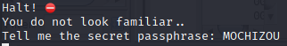

# Challenge

[Passphrase](https://drive.google.com/file/d/1P475lOrqAVC2-n-MYcAm3CCLrfe14cXy/view?usp=sharing)

# Solution

```bash
$ file passphrase
passphrase: ELF 64-bit LSB pie executable, x86-64, version 1 (SYSV), dynamically linked, interpreter /lib64/ld-linux-x86-64.so.2, for GNU/Linux 3.2.0, BuildID[sha1]=60f6b6064d2e34a2b6a24dda9feb943b0b8c360f, not stripped
```

### Ghidra

```C++
undefined8 main(void)

{
  int iVar1;
  size_t sVar2;
  long in_FS_OFFSET;
  char local_58;
  undefined local_57;
  undefined local_56;
  undefined local_55;
  undefined local_54;
  undefined local_53;
  undefined local_52;
  undefined local_51;
  undefined local_50;
  undefined local_4f;
  undefined local_4e;
  undefined local_4d;
  undefined local_4c;
  undefined local_4b;
  undefined local_4a;
  undefined local_49;
  undefined local_48;
  undefined local_47;
  undefined local_46;
  undefined local_45;
  undefined local_44;
  undefined local_43;
  undefined local_42;
  undefined local_41;
  undefined local_40;
  undefined local_3f;
  undefined local_3e;
  undefined local_3d;
  char acStack57 [41];
  long local_10;
  
  local_10 = *(long *)(in_FS_OFFSET + 0x28);
  setbuf(stdout,(char *)0x0);
  local_58 = '3';
  local_57 = 0x78;
  local_56 = 0x74;
  local_55 = 0x72;
  local_54 = 0x34;
  local_53 = 0x74;
  local_52 = 0x33;
  local_51 = 0x72;
  local_50 = 0x52;
  local_4f = 0x33;
  printstr(&DAT_00100bc8);
  printstr("\nYou do not look familiar..");
  printstr("\nTell me the secret passphrase: ");
  local_4e = 0x73;
  local_4d = 0x74;
  local_4c = 0x52;
  local_4b = 0x31;
  local_4a = 0x34;
  local_49 = 0x4c;
  local_48 = 0x35;
  local_47 = 0x5f;
  local_46 = 0x56;
  fgets(acStack57 + 1,0x28,stdin);
  local_45 = 0x53;
  local_44 = 0x5f;
  local_43 = 0x68;
  local_42 = 0x75;
  sVar2 = strlen(acStack57 + 1);
  acStack57[sVar2] = '\0';
  local_41 = 0x6d;
  local_40 = 0x34;
  local_3f = 0x6e;
  local_3e = 0x35;
  local_3d = 0;
  iVar1 = strcmp(&local_58,acStack57 + 1);
  if (iVar1 == 0) {
    puts(&DAT_00100c2e);
    printf("\x1b[32m");
    printf(
           "\nSorry for suspecting you, please transfer this important message to the chief:CHTB{%s}\n\n"
           ,acStack57 + 1);
  }
  else {
    printf("\x1b[31m");
    printstr(&DAT_00100c17);
  }
  if (local_10 != *(long *)(in_FS_OFFSET + 0x28)) {
                    /* WARNING: Subroutine does not return */
    __stack_chk_fail();
  }
  return 0;
}
```

Ta thấy rằng chương trình chỉ kiểm tra ngay đoạn `iVar1 = strcmp(&local_58,acStack57 + 1);`, ta sẽ dùng IDA debug để lấy flag:

<p align="center">
  
</p>

<p align="center">
  
</p>

<p align="center">
  
</p>

<p align="center">
  
</p>

`CHTB{3xtr4t3rR3stR14L5_VS_hum4n5}`