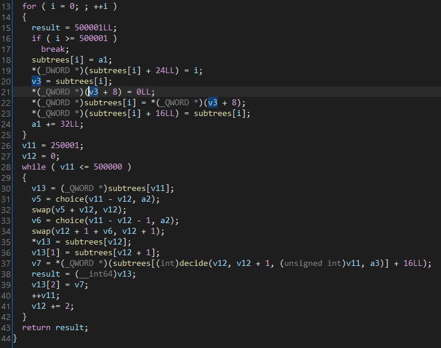

# Challenge

<p align="center">
  
</p>

# File: [foliage](./foliage)

# Solve:

Bài này mình sẽ chi tiết vào từng hàm, vì chúng ta cần hiểu code đang làm gì để có thể đưa ra được hướng giải quyết chính xác nhất.  
Mở IDA lên thì mình thấy có hàm `init_tree()`:

<p align="center">
  
</p>

Nhìn hình trên, ta còn thấy một hàm cần phải được nói sơ qua là hàm `init_rnd()`. Cơ bản thì hàm sẽ tạo ra 2 tham số có giá trị ngẫu nhiên, và chúng ta chỉ được biết 1 trong 2 tham số có giá trị là gì, mình sẽ đặt tên 2 tham số đó là `known_seed` và `unknown_seed` trong phần tiếp theo của Write Up.  
Ta sẽ phân tích hàm `init_tree()`, đây là một hàm đóng vai trò khá quan trọng trong hàm:

<p align="center">
  
</p>

Ở vòng for đầu tiên, chương trình sẽ khởi tạo 500001 ô nhớ tương ứng với 500001 địa chỉ trong heap cho mảng `subtrees`, Mỗi ô nhớ của `subtrees` trong heap đều có 1 cấu trúc giống nhau: 16 bytes đầu tiên sẽ có giá trị là 0, 8 bytes tiếp theo lưu địa chỉ của ô nhớ và 8 bytes cuối cùng dùng để đánh số ô nhớ, vậy sẽ mất 32 bytes cho 1 ô nhớ, gồm 3 buffer đầu và 1 buffer cuối cho việc đánh số. Mục đích mình tách ra 2 loại buffer như thế để cho tiện trong việc trình bày tiếp theo.
Ở vòng for thứ hai chương trình sẽ làm như sau:  
  * Khởi tạo 2 con trỏ v11 và v12 để trỏ vào từng ô trong mảng `subtrees`. Chi tiết hơn thì sẽ trỏ các vị trí `v12`, `v12 + 1` và `v11`
  * `choice(x, y)` sẽ trả về giá trị random từ `0` đến `x-1` dựa trên seed `y`. Vậy biến `v5` và biến `v6` sẽ là một giá trị bất kì lần lượt từ `[0, v11-v12]` và `[0, v11-v12-1]` dựa trên `known_seed` mà đề bài cho biết trước.
  * Sau khi chọn xong, chương trình sẽ swap vị trí `v5+v12` với `v12` trong subtrees, tương tự với `v6+v12+1` với `v12+1`
  * Nhớ lại cấu trúc 1 ô nhớ của mảng `subtrees`, chương trình sẽ gán 2 buffer đầu tiên lần lượt là giá trị của `subtrees[v12]` và `subtrees[v12+1]` - địa chỉ của các ô nhớ trong heap
  * buffer thứ 3 sẽ được gán bằng 1 trong 3 địa chỉ của heap ở `buffer thứ 3` của `subtrees[v12]`, `subtrees[v12+1]`, `subtrees[v11]` dựa trên `unknown_seed`. Mình biết đoạn này hơi phức tạp nên các bạn có thể debug để hiểu thêm chương trình

Chúng ta sẽ lùi lại một bước và suy nghĩ thử xem, thực chất vòng for thứ 2 thực sự đang làm gì:  
Chương trình sẽ tạo ra một cây nhị phân, việc xây dựng cây sẽ được thực hiện bằng cách chọn 2 nút `v5+v12` và `v6+v12+1` sẽ là con của nút `v11`. Đồng thời chọn 1 trong các nút là con của `v11` làm đại diện cho tập hợp bộ 3 nút đó.  
P/s: Ở đây mình không thể nói được lí do tại sao nó lại swap ở bước số 2 do mình không biết dùng từ gì để diễn tả, có thể nếu quay video vừa debug vừa giải thích thì mình sẽ nói rõ được vấn đề này :D  
Quay lại vấn đề chính, vậy ta biết rằng chương trình sẽ tạo ra một cây nhị phân. Ta xem tiếp đoạn tiếp theo của chương trình.  

<p align="center">
  
</p>

Tóm tắt lại thì chương trình sẽ in ra 2 nút bất kì, và yêu cầu mình tìm cha chung nhỏ nhất của 2 nút.  
Tới đây thì chúng ta phải đi vào lí thuyết về thuật toán một chút: Trong lĩnh vực về các cuộc thi toán học, có một vấn đề trong bài toán `Tree Traversal` đó chính là `Lowest Common Ancestor`, hay viết tắt là `LCA`. Đây là một bài toán khó nói chung trong các đề thi thuật toán (Các bạn có thể tham khảo trong link này: [https://vnoi.info/wiki/algo/data-structures/lca.md](https://vnoi.info/wiki/algo/data-structures/lca.md))  
Chương trình cho chúng ta 50000 truy vấn, và yêu cầu mỗi truy vấn tìm cha chung nhỏ nhất của 2 nút con. Trong trường hợp tệ nhất, nếu như cây được xây dựng là một cây nhị phân bị suy thoái, nghĩa là độ dài của cây sẽ gần bằng với `n` nếu cây có `n` nút, thì độ phức tạp sẽ là O(50000 * 500000), đây là một độ phức tạp rất lớn.  
Tuy nhiên ở bài này, mình sẽ mặc địch cho rằng chiều cao của cây sẽ là `log2(500000)` vì đơn giản là cây được tạo bằng thuật toán random, cho nên thuật toán của mình được trình bày như sau:
  * Nếu độ cao của 2 nút chưa bằng nhau, thì mình sẽ lấy nút có độ cao lớn hơn đi ngược lên trên các nút cha cho tới khi độ cao đã bằng với nút còn lại
  * Từ đây, ta sẽ cho 2 nút con cùng lúc đi ngược lên nút cha cho tới khi nào 2 nút đó bằng nhau, nghĩa là ta đã đi tới được cha chung của 2 nút con. Tới đây thuật toán sẽ dừng lại
  
Mình viết 2 script c++ để tìm đáp án cho từng truy vấn và python dùng để gửi kết quả lên server:

## script.cpp
```c++
#include <bits/stdc++.h>

#define ulong unsigned long long

using namespace std;

struct node {
    int l, r, h, pre;
};

ulong seed;
int id[500100];
node arr[500100];

ulong lcg(ulong param_1) {
    param_1 = param_1 * 0x5851f42d4c957f2d + 1;
    return param_1;
}

ulong choice(ulong param_1, ulong param_2) {
  return param_2 % param_1;
}

void init_tree() {
    int v11 = 250001;
    int v12 = 0;

    while (v11 <= 500000) {
        int v13 = id[v11];
        seed = lcg(seed);
        int v5 = choice(v11 - v12, seed);
        if (v5 + v12 != v12)
            swap(id[v5 + v12], id[v12]);
        seed = lcg(seed);
        int v6 = choice(v11 - v12 - 1, seed);
        if (v12 + v6 != v12)
            swap(id[v12 + 1 + v6], id[v12 + 1]);

        int u = id[v12], v = id[v12 + 1];

        arr[v13].l = u;
        arr[v13].r = v;
        arr[u].pre = v13;
        arr[v].pre = v13;

        v11 += 1;
        v12 += 2;
    }
}

void init_data() {
    for (int i=0; i<=500000; i++) {
        id[i] = i;
        arr[i].l = -1;
        arr[i].r = -1;
        arr[i].pre = -1;
        arr[i].h = 0;
    }
}
//66022
void process_tree() {
    for (int i=0; i<50000; i++) {
        int x, y;       cin >> x >> y;
        while (arr[x].h > arr[y].h) x = arr[x].pre;
        while (arr[y].h > arr[x].h) y = arr[y].pre;

        while (arr[x].pre != arr[y].pre) {
            x = arr[x].pre;
            y = arr[y].pre;
        }

        cout << arr[x].pre;
        cout << endl;
    }
}

void DFS(int node, int height) {
    arr[node].h = height + 1;

    if (arr[node].l != -1) DFS(arr[node].l, height + 1);
    if (arr[node].r != -1) DFS(arr[node].r, height + 1);
}

void debug_info() {
    for (int i=0; i<=500000; i++)
        if (arr[i].h == 2)
        cout << i << endl;
}

int main() {
    cin >> seed;
    init_data();
    init_tree();
    DFS(500000, -1);

//    debug_info();

    process_tree();
    return 0;
}
```

## script.py 
```python 
from pwn import *

ans = []
p = process("./a.out")
f = remote("chal.imaginaryctf.org", 42013)
# f = process("./foliage")

print(f.recvuntil("seed: "))
seed = int(f.recvline().decode('utf-8'))

print(seed)
print(f.recv())
p.sendline(str(seed))

f.sendline('42')
x = 0
y = 0
for i in range(50000):
	text = f.recvline().decode('utf-8')
	x = int(text.split(' ')[0])
	y = int(text.split(' ')[1])
	p.sendline('{} {}'.format(x, y))
	text = p.recv()
	res = int(text.decode('utf-8'))
	ans.append(res)

print(f.recv())

for i in range(50000):
	f.sendline(str(ans[i]))

print(f.recv())
```

`ictf{I_can_f1n4lly_see_the_forest_through_the_tr33s}`