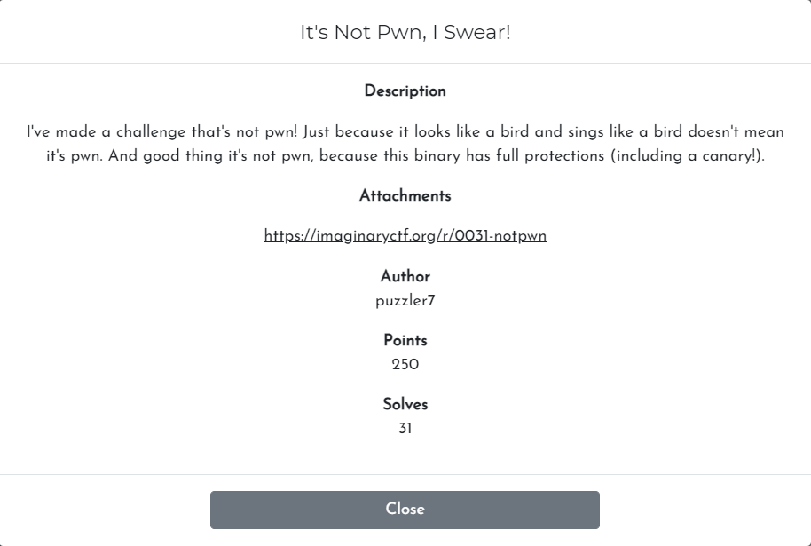
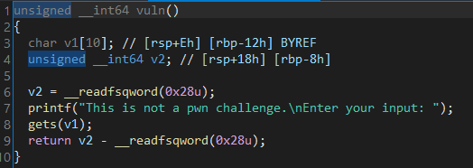
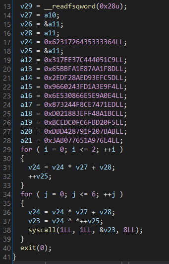
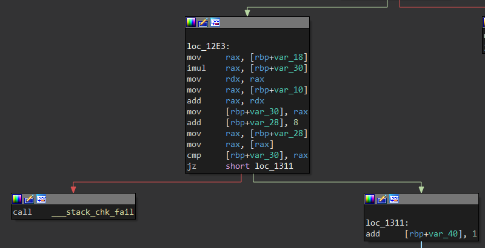
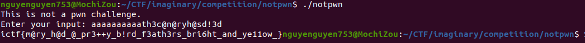

# Challenge

<p align="center">
  
</p>

# File: [notpwn](./notpwn)

# Solve:

Bỏ vào IDA xem thì thấy nhìn có vẻ giống pwn :p, nhìn vào hàm vuln thì có một điều khá kì lạ

<p align="center">
  
</p>

`return v2 - __readfsqword(0x28u);`, hình như có gì đó không ổn. Stack canary được kiểm tra bằng cách xor `__readfsqword(0x28u)`  với giá trị nằm sát bên ngoài stack. Nhưng ở đây chương trình lại đem đi trừ. Mình thử nhảy vô hàm `__stack_chk_fail` để xem thử:

<p align="center">
  
</p>

À, đây là nơi sẽ kiểm tra input của chúng ta. Lưu ý để có thể nhảy vào được hàm `__stack_chk_fail` thì chúng ta cần phải làm cho tràn stack. Ở đây input phải có độ dài lớn hơn 10 thì chúng ta mới nhảy vô được, và input được kiểm tra ở vị trí số 11 trở đi.  

<p align="center">
  
</p>

Ở đoạn code này, chương trình sẽ kiểm tra Input của chúng ta bằng biểu thức `v24 = v24 * v27 + v28;` với `v27` và `v28` là 2 đoạn input được chia ra làm 2, việc của chúng ta là phải tìm tham số `v24` phù hợp để giải phương trình. Mình sẽ dùng `z3` để tìm input phù hợp.

## script.py
```python
from z3 import *

s = Solver()
r0, r1 = BitVecs('r0 r1', 64)

s.add((r0 * 0x6231726435333364 + r1) & 0xffffffffffffffff == 0x317EE37C444051C9)
s.add((r0 * 0x317EE37C444051C9 + r1) & 0xffffffffffffffff == 0x65BBFA1E87AA1F8D)

if (s.check() == sat):
	print(s.model())

print('a'*10, end = "")

res = [8232701341654542452, 7220151342919084153]
for i in res:
	print(bytes.fromhex(hex(i)[2:]).decode()[::-1], end = "")
```

Kết quả ra là `aaaaaaaaaath3c@n@ryh@sd!3d`, mình đã tự động pad thêm 10 kí tự `a` ở đầu để có thể ghi đè canary. Mình sẽ nhập kết quả này vào chương trình thử:

<p align="center">
  
</p>

`ictf{m@ry_h@d_@_pr3++y_b!rd_f3ath3rs_bri6ht_and_ye11ow_}`