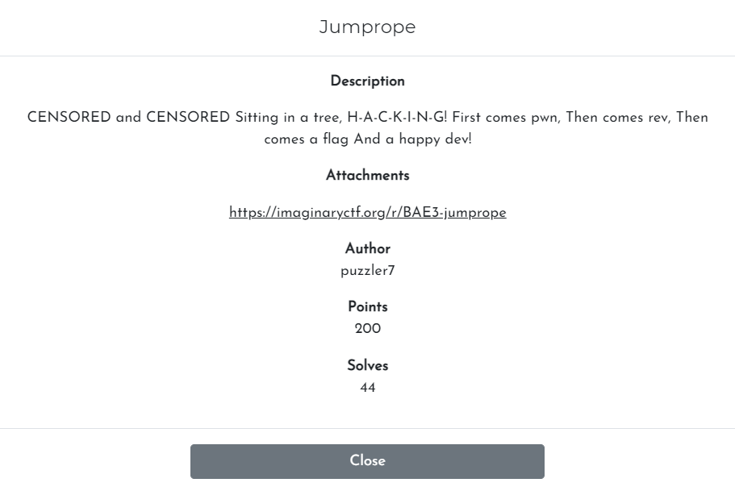
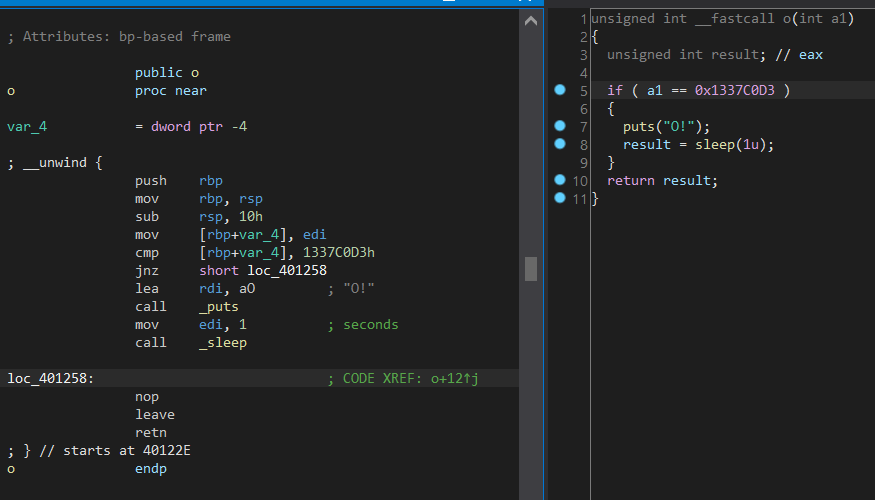

# Challenge

<p align="center">
  
</p>

# File: [jumprope](./jumprope)

# Solve:

Nhìn lướt sơ chương trình thì mình thấy có hàm `checkFlag`. Debug hàm này thêm với việc kiểm tra entry points thì mình thấy rằng còn có các hàm tên `c`, `o`, `r`, `e`, `t`. Lúc này mình đoán rằng mình sẽ nhập vào input, input đó sau khi encrypt sẽ trở thành địa chỉ của các hàm trên, sau cho nhảy vào các hàm theo thứ tự `correct` như đề bài kêu.  
Tuy nhiên, ở hai hàm `o`, `t` còn kiểm tra các tham số truyền vào, nếu xem trong assembly, tham số này chính là thanh ghi `edi`.  

<p align="center">
  
</p>

Bên trái là assembly, bên phải là source code.  
Hình thành được ý tưởng, ta có 2 việc cần làm: Tìm các địa chỉ của các hàm nêu trên và tìm cách để truyền giá trị vào thanh ghi `edi` để so sánh kết quả của 2 hàm `o` và `t`.  
Việc thứ nhất hoàn toàn có thể làm bằng cách ngồi tìm địa chỉ đầu tiên của các hàm (do PIE đã được tắt). Nhưng làm sao để có thể thêm 1 giá trị vào thanh ghi `edi`?  
Mình có tham khảo `pivik` và mình biết đây là một bài ROP. nghĩa là mình đi tìm Gadgets cho bài này để có thể thêm một giá trị tuỳ ý vào thanh ghi `edi` (Chi tiết về ROP các bạn có thể google)  
Mình sẽ xài `ROPgadget` để tìm các gadget:

```bash
nguyenguyen753@MochiZou:~/CTF/imaginary/competition/jumprope$ ROPgadget --binary jumprope 
Gadgets information
============================================================
0x0000000000401099 : add ah, dh ; nop dword ptr [rax + rax] ; ret
0x0000000000401057 : add al, byte ptr [rax] ; add byte ptr [rax], al ; jmp 0x401020
0x0000000000401169 : add al, byte ptr [rax] ; add byte ptr [rax], al ; jmp 0x401187
0x000000000040126f : add al, ch ; jmp 0x401270
0x0000000000401225 : add al, ch ; xor eax, 0x90fffffe ; pop rbp ; ret
0x00000000004010cb : add bh, bh ; loopne 0x401135 ; nop ; ret
0x000000000040126d : add byte ptr [rax], al ; add al, ch ; jmp 0x401270
0x0000000000401037 : add byte ptr [rax], al ; add byte ptr [rax], al ; jmp 0x401020
0x0000000000401160 : add byte ptr [rax], al ; add byte ptr [rax], al ; jmp 0x401197
0x00000000004011c1 : add byte ptr [rax], al ; add byte ptr [rax], al ; jmp 0x4011eb
0x00000000004011a8 : add byte ptr [rax], al ; add byte ptr [rax], al ; jmp 0x401205
0x0000000000401148 : add byte ptr [rax], al ; add byte ptr [rax], al ; nop dword ptr [rax] ; jmp 0x4010e0
0x000000000040137b : add byte ptr [rax], al ; add byte ptr [rax], al ; pop rbp ; ret
0x0000000000401098 : add byte ptr [rax], al ; hlt ; nop dword ptr [rax + rax] ; ret
0x0000000000401039 : add byte ptr [rax], al ; jmp 0x401020
0x000000000040116b : add byte ptr [rax], al ; jmp 0x401187
0x0000000000401162 : add byte ptr [rax], al ; jmp 0x401197
0x00000000004011c3 : add byte ptr [rax], al ; jmp 0x4011eb
0x00000000004011aa : add byte ptr [rax], al ; jmp 0x401205
0x00000000004012fe : add byte ptr [rax], al ; jmp 0x40136f
0x000000000040114a : add byte ptr [rax], al ; nop dword ptr [rax] ; jmp 0x4010e0
0x00000000004012fa : add byte ptr [rax], al ; or byte ptr [rax], al ; add byte ptr [rax], al ; jmp 0x40136f
0x0000000000401195 : add byte ptr [rax], al ; pop rbp ; ret
0x0000000000401034 : add byte ptr [rax], al ; push 0 ; jmp 0x401020
0x0000000000401044 : add byte ptr [rax], al ; push 1 ; jmp 0x401020
0x0000000000401054 : add byte ptr [rax], al ; push 2 ; jmp 0x401020
0x0000000000401064 : add byte ptr [rax], al ; push 3 ; jmp 0x401020
0x000000000040109e : add byte ptr [rax], al ; ret
0x0000000000401009 : add byte ptr [rax], al ; test rax, rax ; je 0x401012 ; call rax
0x000000000040109d : add byte ptr [rax], r8b ; ret
0x0000000000401137 : add byte ptr [rcx], al ; pop rbp ; ret
0x00000000004010ca : add dil, dil ; loopne 0x401135 ; nop ; ret
0x0000000000401047 : add dword ptr [rax], eax ; add byte ptr [rax], al ; jmp 0x401020
0x0000000000401193 : add dword ptr [rax], eax ; add byte ptr [rax], al ; pop rbp ; ret
0x000000000040115c : add dword ptr [rbp + 7], esi ; mov eax, 0 ; jmp 0x401197
0x0000000000401138 : add dword ptr [rbp - 0x3d], ebx ; nop dword ptr [rax + rax] ; ret
0x00000000004012f7 : add eax, 0x3048 ; or byte ptr [rax], al ; add byte ptr [rax], al ; jmp 0x40136f
0x0000000000401067 : add eax, dword ptr [rax] ; add byte ptr [rax], al ; jmp 0x401020
0x0000000000401013 : add esp, 8 ; ret
0x0000000000401012 : add rsp, 8 ; ret
0x000000000040122a : call qword ptr [rax + 0x4855c35d]
0x0000000000401257 : call qword ptr [rax + 0x4855c3c9]
0x0000000000401010 : call rax
0x0000000000401168 : cld ; add al, byte ptr [rax] ; add byte ptr [rax], al ; jmp 0x401187
0x00000000004011a7 : cld ; add byte ptr [rax], al ; add byte ptr [rax], al ; jmp 0x401205
0x000000000040118f : cld ; jl 0x40116f ; mov eax, 1 ; pop rbp ; ret
0x00000000004011a4 : fadd st(7) ; cld ; add byte ptr [rax], al ; add byte ptr [rax], al ; jmp 0x401205
0x0000000000401474 : fisttp word ptr [rax - 0x7d] ; ret
0x0000000000401042 : fisubr dword ptr [rdi] ; add byte ptr [rax], al ; push 1 ; jmp 0x401020
0x000000000040120e : fmul st(1) ; ret
0x0000000000401191 : fnstsw dword ptr [rax + 1] ; pop rbp ; ret
0x000000000040109a : hlt ; nop dword ptr [rax + rax] ; ret
0x000000000040115b : in al, dx ; add dword ptr [rbp + 7], esi ; mov eax, 0 ; jmp 0x401197
0x000000000040100e : je 0x401012 ; call rax
0x00000000004010c5 : je 0x4010d0 ; mov edi, 0x404340 ; jmp rax
0x0000000000401107 : je 0x401110 ; mov edi, 0x404340 ; jmp rax
0x00000000004011a3 : jge 0x40117d ; mov dword ptr [rbp - 4], 0 ; jmp 0x401205
0x0000000000401190 : jl 0x40116f ; mov eax, 1 ; pop rbp ; ret
0x0000000000401209 : jle 0x4011ae ; mov rax, qword ptr [rbp - 0x28] ; leave ; ret
0x0000000000401378 : jle 0x401302 ; mov eax, 0 ; pop rbp ; ret
0x000000000040103b : jmp 0x401020
0x0000000000401150 : jmp 0x4010e0
0x000000000040116d : jmp 0x401187
0x0000000000401164 : jmp 0x401197
0x00000000004011c5 : jmp 0x4011eb
0x00000000004011ac : jmp 0x401205
0x0000000000401271 : jmp 0x401270
0x0000000000401300 : jmp 0x40136f
0x00000000004010cc : jmp rax
0x000000000040115d : jne 0x401166 ; mov eax, 0 ; jmp 0x401197
0x000000000040117a : jne 0x401183 ; mov eax, 0 ; jmp 0x401197
0x000000000040120f : leave ; ret
0x0000000000401032 : loop 0x401063 ; add byte ptr [rax], al ; push 0 ; jmp 0x401020
0x00000000004010cd : loopne 0x401135 ; nop ; ret
0x0000000000401379 : mov byte ptr [rax], bh ; pop rbp ; ret
0x0000000000401132 : mov byte ptr [rip + 0x3207], 1 ; pop rbp ; ret
0x00000000004011be : mov dword ptr [rbp - 0x1c], 0 ; jmp 0x4011eb
0x00000000004011a5 : mov dword ptr [rbp - 4], 0 ; jmp 0x401205
0x0000000000401166 : mov dword ptr [rbp - 4], 2 ; jmp 0x401187
0x000000000040115f : mov eax, 0 ; jmp 0x401197
0x000000000040137a : mov eax, 0 ; pop rbp ; ret
0x0000000000401192 : mov eax, 1 ; pop rbp ; ret
0x000000000040120c : mov eax, dword ptr [rbp - 0x28] ; leave ; ret
0x00000000004010c7 : mov edi, 0x404340 ; jmp rax
0x000000000040120b : mov rax, qword ptr [rbp - 0x28] ; leave ; ret
0x0000000000401258 : nop ; leave ; ret
0x000000000040122b : nop ; pop rbp ; ret
0x00000000004010cf : nop ; ret
0x000000000040109b : nop dword ptr [rax + rax] ; ret
0x000000000040114c : nop dword ptr [rax] ; jmp 0x4010e0
0x000000000040148d : nop dword ptr [rax] ; ret
0x00000000004012fc : or byte ptr [rax], al ; add byte ptr [rax], al ; jmp 0x40136f
0x00000000004010c6 : or dword ptr [rdi + 0x404340], edi ; jmp rax
0x0000000000401484 : pop r12 ; pop r13 ; pop r14 ; pop r15 ; ret
0x0000000000401486 : pop r13 ; pop r14 ; pop r15 ; ret
0x0000000000401488 : pop r14 ; pop r15 ; ret
0x000000000040148a : pop r15 ; ret
0x0000000000401483 : pop rbp ; pop r12 ; pop r13 ; pop r14 ; pop r15 ; ret
0x0000000000401487 : pop rbp ; pop r14 ; pop r15 ; ret
0x0000000000401139 : pop rbp ; ret
0x0000000000401377 : pop rdi ; jle 0x401302 ; mov eax, 0 ; pop rbp ; ret
0x000000000040148b : pop rdi ; ret
0x0000000000401489 : pop rsi ; pop r15 ; ret
0x0000000000401485 : pop rsp ; pop r13 ; pop r14 ; pop r15 ; ret
0x0000000000401036 : push 0 ; jmp 0x401020
0x0000000000401046 : push 1 ; jmp 0x401020
0x0000000000401056 : push 2 ; jmp 0x401020
0x0000000000401066 : push 3 ; jmp 0x401020
0x0000000000401016 : ret
0x0000000000401346 : ret 0x8b48
0x0000000000401062 : retf 0x2f
0x0000000000401353 : retf 0x58b
0x0000000000401179 : sal byte ptr [rbp + 7], 0xb8 ; add byte ptr [rax], al ; add byte ptr [rax], al ; jmp 0x401197
0x000000000040100d : sal byte ptr [rdx + rax - 1], 0xd0 ; add rsp, 8 ; ret
0x0000000000401052 : shr byte ptr [rdi], cl ; add byte ptr [rax], al ; push 2 ; jmp 0x401020
0x0000000000401495 : sub esp, 8 ; add rsp, 8 ; ret
0x0000000000401494 : sub rsp, 8 ; add rsp, 8 ; ret
0x000000000040100c : test eax, eax ; je 0x401012 ; call rax
0x00000000004010c3 : test eax, eax ; je 0x4010d0 ; mov edi, 0x404340 ; jmp rax
0x0000000000401105 : test eax, eax ; je 0x401110 ; mov edi, 0x404340 ; jmp rax
0x0000000000401178 : test eax, eax ; jne 0x401183 ; mov eax, 0 ; jmp 0x401197
0x000000000040100b : test rax, rax ; je 0x401012 ; call rax
0x0000000000401135 : xor al, byte ptr [rax] ; add byte ptr [rcx], al ; pop rbp ; ret
0x0000000000401227 : xor eax, 0x90fffffe ; pop rbp ; ret
0x0000000000401165 : xor edi, eax ; cld ; add al, byte ptr [rax] ; add byte ptr [rax], al ; jmp 0x401187

Unique gadgets found: 125
```

Mình thấy `0x000000000040148b : pop rdi ; ret` có vẻ hợp lí, thế mình dùng địa chỉ này, viết script để decode ra input thử xem có đúng không

## script.cpp
```python
#include <bits/stdc++.h>

using namespace std;

#define ulong unsigned long
#define uint unsigned int

int listt[10000] = {253, 60, 196, 14, 118, 255, 75, 69, 31, 64, 244, 230, 128, 184, 181, 232, 118, 142, 59, 248, 228, 189, 201, 199, 63, 230, 207, 21, 148, 154, 138, 40, 78, 94, 30, 63, 37, 212, 44, 169, 54, 40, 66, 64, 147, 141, 15, 255, 174, 43, 43, 223, 126, 26, 78, 5, 99, 208, 136, 225, 161, 31, 90, 61, 54, 79, 174, 137, 123, 215, 39, 208, 41, 192, 158, 240, 32, 223, 105, 119, 148, 233, 88, 15, 184, 236, 249, 36};
int addr[1000] = {17, 18, 64, 0, 0, 0, 0, 0, 139, 20, 64, 0, 0, 0, 0, 0, 211, 192, 55, 19, 0, 0, 0, 0, 66, 18, 64, 0, 0, 0, 0, 0, 91, 18, 64, 0, 0, 0, 0, 0, 91, 18, 64, 0, 0, 0, 0, 0, 120, 18, 64, 0, 0, 0, 0, 0, 17, 18, 64, 0, 0, 0, 0, 0, 139, 20, 64, 0, 0, 0, 0, 0, 206, 250, 173, 222, 0, 0, 0, 0, 149, 18, 64, 0, 0, 0, 0, 0};

int test(int param_1)
{
  int uVar1;
  int local_c;

  if (param_1 == 1) {
    uVar1 = 0;
  }
  else {
    local_c = 2;
    while (local_c < param_1 + -1) {
      if (param_1 % local_c == 0) {
        return 0;
      }
      local_c = local_c + 1;
    }
    uVar1 = 1;
  }
  return uVar1;
}

ulong next(ulong param_1)
{
  int iVar1;
  ulong local_30;
  int local_24;
  ulong local_20;
  ulong local_18;
  int local_c;

  local_c = 0;
  local_30 = param_1;
  while (local_c < 8) {
    local_18 = 0;
    local_20 = local_30;
    local_24 = 0;
    while (local_24 < 8) {
      iVar1 = test(local_24 + 1);
      if (iVar1 != 0) {
        local_18 = local_18 ^ (uint)local_20 & 1;
      }
      local_20 = local_20 >> 1;
      local_24 = local_24 + 1;
    }
    local_30 = (local_30 >> 1) + local_18 * 0x80;
    local_c = local_c + 1;
  }
  return local_30;
}

int main() {
    int val = 2, num = 0;
    cout << (0xcb ^ listt[8] ^ (int)'_') << endl;
    for (int i=8; i<=95; i++) {
        val = next(val) & 0xff;

        int k = (val ^ (listt[(num)] & 0xff)) & 0xff;

        cout << (char)((k ^ addr[num]) & 0xff);
        num += 1;
    }
}
```

Đây là script mình giải được viết bằng c++. Để cho các bạn đọc có thể dễ hiểu ý tưởng của bài, mình sẽ kèm thêm một script viết bằng python để in ra các giá trị của địa chỉ:

## script.py
```python
c = 0x0000000000401211
gadgets = 0x000000000040148b
o = 0x0000000000401242
e = 0x0000000000401278
r = 0x000000000040125B
t = 0x0000000000401295

li = []

def convert(val):
	for i in range(8):
		k = i * 8
		car = (val >> k) & 0xff
		li.append(car)

convert(c)
convert(gadgets)
convert(0x1337C0D3)
convert(o)
convert(r)
convert(r)
convert(e)
convert(c)
convert(gadgets)
convert(0xDEADFACE)
convert(t)

print(li)
print(len(li))

k = [int(i, 16) for i in '0FD, 3C, 0C4, 0E, 76, 0FF, 4B, 45, 1F, 40, 0F4, 0E6, 80, 0B8, 0B5, 0E8, 76, 8E, 3B, 0F8, 0E4, 0BD, 0C9, 0C7, 3F, 0E6, 0CF, 15, 94, 9A, 8A, 28, 4E, 5E, 1E, 3F, 25, 0D4, 2C, 0A9, 36, 28, 42, 40, 93, 8D, 0F, 0FF, 0AE, 2B, 2B, 0DF, 7E, 1A, 4E, 5, 63, 0D0, 88, 0E1, 0A1, 1F, 5A, 3D, 36, 4F, 0AE, 89, 7B, 0D7, 27, 0D0, 29, 0C0, 9E, 0F0, 20, 0DF, 69, 77, 94, 0E9, 58, 0F, 0B8, 0EC, 0F9, 24'.split(', ')]
o = [17, 18, 64, 0, 0, 0, 0, 0, 46, 18, 64, 0, 0, 0, 0, 0, 91, 18, 64, 0, 0, 0, 0, 0, 91, 18, 64, 0, 0, 0, 0, 0, 120, 18, 64, 0, 0, 0, 0, 0, 17, 18, 64, 0, 0, 0, 0, 0, 149, 18, 64, 0, 0, 0, 0, 0]

print(k)
print(len(o))
print(len(k))
```

`ictf{n0t_last_night_but_the_night_bef0re_twenty_f0ur_hackers_came_a_kn0cking_at_my_d00r}`