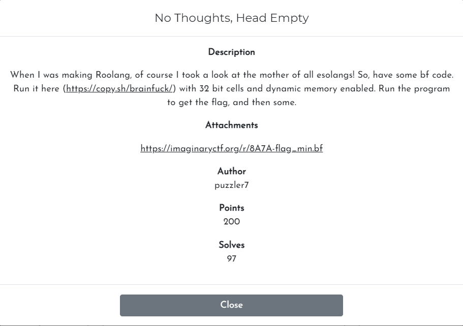

# Challenge

<p align="center">
  
</p>

# File: [stings](./stings)

# Solve:

Đây là một bài được viết bằng `brainf*ck`. Sau khi hỏi anh Google thì mình tìm được cách chuyển từ `brainf*ck` sang c: [https://github.com/paulkaefer/bftoc](https://github.com/paulkaefer/bftoc)  
Dưới đây là source code viết bằng c sau khi được chuyển:

```c++
/* This is a translation of flag_min.bf, generated by bftoc.py (by Paul Kaefer)
 * It was generated on Tuesday, July 27, 2021 at 07:18PM
 */

#include <stdio.h>

void main(void)
{
    int size = 1000;
    int tape[size];
    int i = 0;

    /* Clearing the tape (array) */
    for (i=0; i<size; i++)
        tape[i] = 0;

    int ptr = 0;

    ptr += 2;
    tape[ptr] += 11;
    while (tape[ptr] != 0)
    {
        ptr -= 1;
        tape[ptr] += 11;
        ptr += 1;
        tape[ptr] -= 1;
    }
    tape[ptr] -= 2;
    while (tape[ptr] != 0)
    {
        ptr -= 1;
        tape[ptr] -= 8;
        ptr += 1;
        tape[ptr] += 1;
    }
    ptr += 1;
    tape[ptr] += 10;
    while (tape[ptr] != 0)
    {
        ptr -= 1;
        tape[ptr] += 10;
        ptr += 1;
        tape[ptr] -= 1;
    }
    tape[ptr] -= 1;
    while (tape[ptr] != 0)
    {
        ptr -= 1;
        tape[ptr] -= 1;
        ptr += 1;
        tape[ptr] += 1;
    }
    ptr += 1;
    tape[ptr] += 11;
    while (tape[ptr] != 0)
    {
        ptr -= 1;
        tape[ptr] += 11;
        ptr += 1;
        tape[ptr] -= 1;
    }
    tape[ptr] -= 1;
    while (tape[ptr] != 0)
    {
        ptr -= 1;
        tape[ptr] -= 5;
        ptr += 1;
        tape[ptr] += 1;
    }
    ptr += 1;
    tape[ptr] += 11;
    while (tape[ptr] != 0)
    {
        ptr -= 1;
        tape[ptr] += 11;
        ptr += 1;
        tape[ptr] -= 1;
    }
    tape[ptr] -= 1;
    while (tape[ptr] != 0)
    {
        ptr -= 1;
        tape[ptr] -= 19;
        ptr += 1;
        tape[ptr] += 1;
    }
    ptr += 1;
    tape[ptr] += 12;
    while (tape[ptr] != 0)
    {
        ptr -= 1;
        tape[ptr] += 12;
        ptr += 1;
        tape[ptr] -= 1;
    }
    tape[ptr] -= 3;
    while (tape[ptr] != 0)
    {
        ptr -= 1;
        tape[ptr] -= 7;
        ptr += 1;
        tape[ptr] += 1;
    }
    ptr += 1;
    tape[ptr] += 7;
    while (tape[ptr] != 0)
    {
        ptr -= 1;
        tape[ptr] += 7;
        ptr += 1;
        tape[ptr] -= 1;
    }
    tape[ptr] -= 1;
    while (tape[ptr] != 0)
    {
        ptr -= 1;
        tape[ptr] -= 1;
        ptr += 1;
        tape[ptr] += 1;
    }
    ptr += 1;
    tape[ptr] += 11;
    while (tape[ptr] != 0)
    {
        ptr -= 1;
        tape[ptr] += 11;
        ptr += 1;
        tape[ptr] -= 1;
    }
    tape[ptr] -= 1;
    while (tape[ptr] != 0)
    {
        ptr -= 1;
        tape[ptr] -= 11;
        ptr += 1;
        tape[ptr] += 1;
    }
    ptr += 1;
    tape[ptr] += 8;
    while (tape[ptr] != 0)
    {
        ptr -= 1;
        tape[ptr] += 8;
        ptr += 1;
        tape[ptr] -= 1;
    }
    tape[ptr] -= 1;
    while (tape[ptr] != 0)
    {
        ptr -= 1;
        tape[ptr] -= 13;
        ptr += 1;
        tape[ptr] += 1;
    }
    ptr += 1;
    tape[ptr] += 10;
    while (tape[ptr] != 0)
    {
        ptr -= 1;
        tape[ptr] += 10;
        ptr += 1;
        tape[ptr] -= 1;
    }
    tape[ptr] -= 1;
    while (tape[ptr] != 0)
    {
        ptr -= 1;
        tape[ptr] -= 5;
        ptr += 1;
        tape[ptr] += 1;
    }
    ptr += 1;
    tape[ptr] += 10;
    while (tape[ptr] != 0)
    {
        ptr -= 1;
        tape[ptr] += 10;
        ptr += 1;
        tape[ptr] -= 1;
    }
    tape[ptr] -= 1;
    while (tape[ptr] != 0)
    {
        ptr -= 1;
        tape[ptr] -= 1;
        ptr += 1;
        tape[ptr] += 1;
    }
    ptr += 1;
    tape[ptr] += 11;
    while (tape[ptr] != 0)
    {
        ptr -= 1;
        tape[ptr] += 11;
        ptr += 1;
        tape[ptr] -= 1;
    }
    tape[ptr] -= 1;
    while (tape[ptr] != 0)
    {
        ptr -= 1;
        tape[ptr] -= 17;
        ptr += 1;
        tape[ptr] += 1;
    }
    ptr += 1;
    tape[ptr] += 8;
    while (tape[ptr] != 0)
    {
        ptr -= 1;
        tape[ptr] += 8;
        ptr += 1;
        tape[ptr] -= 1;
    }
    ptr += 1;
    tape[ptr] += 11;
    while (tape[ptr] != 0)
    {
        ptr -= 1;
        tape[ptr] += 11;
        ptr += 1;
        tape[ptr] -= 1;
    }
    tape[ptr] -= 1;
    while (tape[ptr] != 0)
    {
        ptr -= 1;
        tape[ptr] -= 7;
        ptr += 1;
        tape[ptr] += 1;
    }
    ptr += 1;
    tape[ptr] += 8;
    while (tape[ptr] != 0)
    {
        ptr -= 1;
        tape[ptr] += 8;
        ptr += 1;
        tape[ptr] -= 1;
    }
    ptr += 1;
    tape[ptr] += 10;
    while (tape[ptr] != 0)
    {
        ptr -= 1;
        tape[ptr] += 10;
        ptr += 1;
        tape[ptr] -= 1;
    }
    tape[ptr] -= 1;
    while (tape[ptr] != 0)
    {
        ptr -= 1;
        tape[ptr] -= 1;
        ptr += 1;
        tape[ptr] += 1;
    }
    ptr += 1;
    tape[ptr] += 11;
    while (tape[ptr] != 0)
    {
        ptr -= 1;
        tape[ptr] += 11;
        ptr += 1;
        tape[ptr] -= 1;
    }
    tape[ptr] -= 1;
    while (tape[ptr] != 0)
    {
        ptr -= 1;
        tape[ptr] -= 5;
        ptr += 1;
        tape[ptr] += 1;
    }
    ptr += 1;
    tape[ptr] += 8;
    while (tape[ptr] != 0)
    {
        ptr -= 1;
        tape[ptr] += 8;
        ptr += 1;
        tape[ptr] -= 1;
    }
    tape[ptr] -= 1;
    while (tape[ptr] != 0)
    {
        ptr -= 1;
        tape[ptr] -= 13;
        ptr += 1;
        tape[ptr] += 1;
    }
    ptr += 1;
    tape[ptr] += 11;
    while (tape[ptr] != 0)
    {
        ptr -= 1;
        tape[ptr] += 11;
        ptr += 1;
        tape[ptr] -= 1;
    }
    tape[ptr] -= 1;
    while (tape[ptr] != 0)
    {
        ptr -= 1;
        tape[ptr] -= 7;
        ptr += 1;
        tape[ptr] += 1;
    }
    ptr += 1;
    tape[ptr] += 10;
    while (tape[ptr] != 0)
    {
        ptr -= 1;
        tape[ptr] += 10;
        ptr += 1;
        tape[ptr] -= 1;
    }
    tape[ptr] -= 1;
    while (tape[ptr] != 0)
    {
        ptr -= 1;
        tape[ptr] -= 5;
        ptr += 1;
        tape[ptr] += 1;
    }
    ptr += 1;
    tape[ptr] += 7;
    while (tape[ptr] != 0)
    {
        ptr -= 1;
        tape[ptr] += 7;
        ptr += 1;
        tape[ptr] -= 1;
    }
    tape[ptr] -= 1;
    while (tape[ptr] != 0)
    {
        ptr -= 1;
        tape[ptr] -= 1;
        ptr += 1;
        tape[ptr] += 1;
    }
    ptr += 1;
    tape[ptr] += 11;
    while (tape[ptr] != 0)
    {
        ptr -= 1;
        tape[ptr] += 11;
        ptr += 1;
        tape[ptr] -= 1;
    }
    tape[ptr] -= 1;
    while (tape[ptr] != 0)
    {
        ptr -= 1;
        tape[ptr] -= 19;
        ptr += 1;
        tape[ptr] += 1;
    }
    ptr += 1;
    tape[ptr] += 10;
    while (tape[ptr] != 0)
    {
        ptr -= 1;
        tape[ptr] += 10;
        ptr += 1;
        tape[ptr] -= 1;
    }
    tape[ptr] -= 1;
    while (tape[ptr] != 0)
    {
        ptr -= 1;
        tape[ptr] -= 5;
        ptr += 1;
        tape[ptr] += 1;
    }
    ptr += 1;
    tape[ptr] += 10;
    while (tape[ptr] != 0)
    {
        ptr -= 1;
        tape[ptr] += 10;
        ptr += 1;
        tape[ptr] -= 1;
    }
    ptr += 1;
    tape[ptr] += 7;
    while (tape[ptr] != 0)
    {
        ptr -= 1;
        tape[ptr] += 7;
        ptr += 1;
        tape[ptr] -= 1;
    }
    ptr += 1;
    tape[ptr] += 11;
    while (tape[ptr] != 0)
    {
        ptr -= 1;
        tape[ptr] += 11;
        ptr += 1;
        tape[ptr] -= 1;
    }
    tape[ptr] -= 1;
    while (tape[ptr] != 0)
    {
        ptr -= 1;
        tape[ptr] -= 19;
        ptr += 1;
        tape[ptr] += 1;
    }
    ptr += 1;
    tape[ptr] += 8;
    while (tape[ptr] != 0)
    {
        ptr -= 1;
        tape[ptr] += 8;
        ptr += 1;
        tape[ptr] -= 1;
    }
    tape[ptr] -= 1;
    while (tape[ptr] != 0)
    {
        ptr -= 1;
        tape[ptr] -= 13;
        ptr += 1;
        tape[ptr] += 1;
    }
    ptr += 1;
    tape[ptr] += 11;
    while (tape[ptr] != 0)
    {
        ptr -= 1;
        tape[ptr] += 11;
        ptr += 1;
        tape[ptr] -= 1;
    }
    tape[ptr] -= 1;
    while (tape[ptr] != 0)
    {
        ptr -= 1;
        tape[ptr] -= 7;
        ptr += 1;
        tape[ptr] += 1;
    }
    ptr += 1;
    tape[ptr] += 8;
    while (tape[ptr] != 0)
    {
        ptr -= 1;
        tape[ptr] += 8;
        ptr += 1;
        tape[ptr] -= 1;
    }
    tape[ptr] -= 1;
    while (tape[ptr] != 0)
    {
        ptr -= 1;
        tape[ptr] -= 13;
        ptr += 1;
        tape[ptr] += 1;
    }
    ptr += 1;
    tape[ptr] += 11;
    while (tape[ptr] != 0)
    {
        ptr -= 1;
        tape[ptr] += 11;
        ptr += 1;
        tape[ptr] -= 1;
    }
    tape[ptr] -= 1;
    while (tape[ptr] != 0)
    {
        ptr -= 1;
        tape[ptr] -= 11;
        ptr += 1;
        tape[ptr] += 1;
    }
    ptr += 1;
    tape[ptr] += 10;
    while (tape[ptr] != 0)
    {
        ptr -= 1;
        tape[ptr] += 10;
        ptr += 1;
        tape[ptr] -= 1;
    }
    tape[ptr] -= 1;
    while (tape[ptr] != 0)
    {
        ptr -= 1;
        tape[ptr] -= 1;
        ptr += 1;
        tape[ptr] += 1;
    }
    ptr += 1;
    tape[ptr] += 11;
    while (tape[ptr] != 0)
    {
        ptr -= 1;
        tape[ptr] += 11;
        ptr += 1;
        tape[ptr] -= 1;
    }
    tape[ptr] -= 4;
    while (tape[ptr] != 0)
    {
        ptr -= 1;
        tape[ptr] -= 5;
        ptr += 1;
        tape[ptr] += 1;
    }
    ptr += 1;
    tape[ptr] += 12;
    while (tape[ptr] != 0)
    {
        ptr -= 1;
        tape[ptr] += 12;
        ptr += 1;
        tape[ptr] -= 1;
    }
    tape[ptr] -= 1;
    while (tape[ptr] != 0)
    {
        ptr -= 1;
        tape[ptr] -= 19;
        ptr += 1;
        tape[ptr] += 1;
    }
    ptr += 2;
    tape[ptr] += 6;
    while (tape[ptr] != 0)
    {
        ptr -= 1;
        tape[ptr] += 6;
        ptr += 1;
        tape[ptr] -= 1;
    }
    tape[ptr] -= 2;
    while (tape[ptr] != 0)
    {
        ptr -= 1;
        tape[ptr] -= 2;
        ptr += 1;
        tape[ptr] += 1;
    }
    tape[ptr] += 1;
    ptr -= 1;
    while (tape[ptr] != 0)
    {
        ptr += 1;
        while (tape[ptr] != 0)
        {
            tape[ptr] -= 1;
            ptr += 1;
            tape[ptr] += 1;
            ptr += 1;
            tape[ptr] += 2;
            ptr -= 2;
        }
        ptr += 2;
        while (tape[ptr] != 0)
        {
            tape[ptr] -= 1;
            ptr -= 2;
            tape[ptr] += 1;
            ptr += 2;
        }
        ptr -= 1;
        while (tape[ptr] != 0)
        {
            while (tape[ptr] != 0)
            {
                ptr -= 1;
            }
            ptr -= 1;
            while (tape[ptr] != 0)
            {
                ptr -= 1;
            }
            ptr += 1;
            printf("%c",tape[ptr]);
            while (tape[ptr] != 0)
            {
                ptr += 1;
            }
            ptr += 1;
            while (tape[ptr] != 0)
            {
                ptr += 1;
            }
            ptr -= 1;
            tape[ptr] -= 1;
        }
        while (tape[ptr] != 0)
        {
            ptr -= 1;
        }
        ptr -= 1;
        while (tape[ptr] != 0)
        {
            ptr -= 1;
        }
        ptr -= 1;
        while (tape[ptr] != 0)
        {
            ptr -= 1;
        }
        ptr += 1;
        while (tape[ptr] != 0)
        {
            tape[ptr] -= 1;
        }
        ptr += 1;
        while (tape[ptr] != 0)
        {
            ptr += 1;
        }
        ptr += 1;
        tape[ptr] -= 1;
    }

}
```

Nhìn sơ qua đoạn code thì ta có thể thấy được 2 phần chính: phần khởi tạo giá trị cho mảng `tape` và phần in ra các giá trị. Mình ngồi dọc chương trình được 1 lúc thì thấy rằng flag được lưu từ 0 đến 31, vì thế mình chỉ việc in ra flag.

`ictf{0n3_ch@r@ct3r_0f_d1f3r3nce}`

### P/s
Bài `Fewer Thoughts, Head Emptier` tương tự như bài này nên mình sẽ không viết Write Up bài đó. Nếu có thắc mắc về bài đó các bạn có thể liên lạc cá nhân với mình.