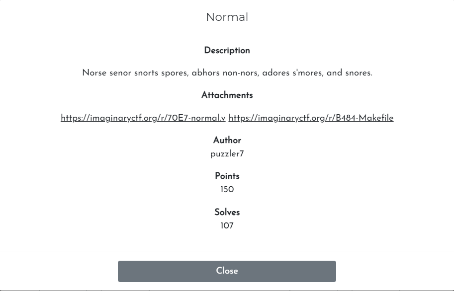
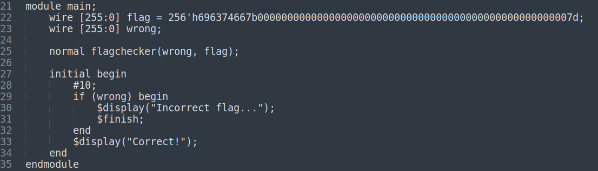
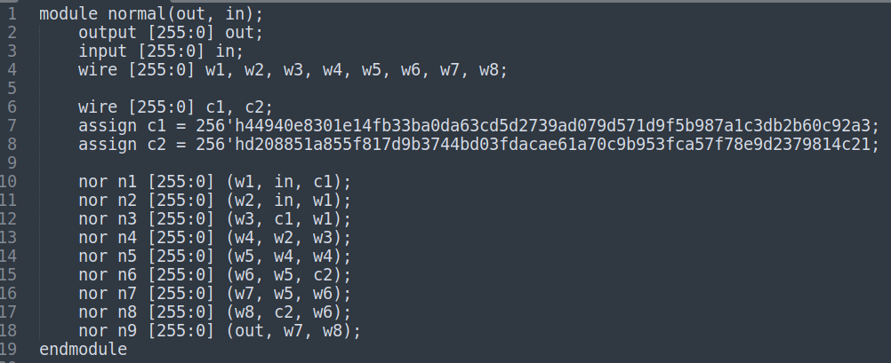

# Challenge

<p align="center">
  
</p>

# File: [normal.v](./normal.v) [Makefile](./Makefile) 

# Solve:

Sau khi một hồi tham khảo google thì mình biết file `normal.v` được viết bằng ngôn ngữ `Verilog`, còn file `Makefile` chỉ để compile file `normal.v` và chạy chương trình.  
Lúc này mình cảm thấy rất làm biếng học về `Verilog`, nên mình quyết định đoán cách hoạt động của từng lệnh trong chương trình, và mình đã đoán đúng :D  

<p align="center">
  
</p>

Mình đổi thử biến `flag` từ hex sang strings thì kết quả là `ictf{\x00\x00\x00\x00\x00\x00\x00\x00\x00\x00\x00\x00\x00\x00\x00\x00\x00\x00\x00\x00\x00\x00\x00\x00\x00\x00}`  
Sau đó mình nhìn lên `module normal`

<p align="center">
  
</p>

Mình nghĩ biến `in` sẽ là flag ta nhập, còn `out` sẽ đưa ra kết quả đúng hay sai dựa trên kết quả của các phép biến đổi. Suy nghĩ hướng đi như thế, mình dùng `z3` để giải bài này như sau:

## script.py
```python
from z3 import *

a = int('44940e8301e14fb33ba0da63cd5d2739ad079d571d9f5b987a1c3db2b60c92a3', 16)
b = int('d208851a855f817d9b3744bd03fdacae61a70c9b953fca57f78e9d2379814c21', 16)

s = Solver()
flag, c1, c2, w1, w2, w3, w4, w5, w6, w7, w8, out = BitVecs('flag c1 c2 w1 w2 w3 w4 w5 w6 w7 w8 out', 32 * 8)

c1 = a
c2 = b
s.add(w1 == ~(flag | c1))
s.add(w2 == ~(flag | w1))
s.add(w3 == ~(w1 | c1))
s.add(w4 == ~(w2 | w3))
s.add(w5 == ~(w4 | w4))
s.add(w6 == ~(w5 | c2))
s.add(w7 == ~(w5 | w6))
s.add(w8 == ~(c2 | w6))
# out = 
s.add((~(w7 | w8)) == 0)

print(s.check())
print(s.model())
```

Và mình bất ngờ khi nó ra được kết qu. Đổi kết quả từ decimal sang string text

`ictf{A11_ha!1_th3_n3w_n0rm_n0r!}`