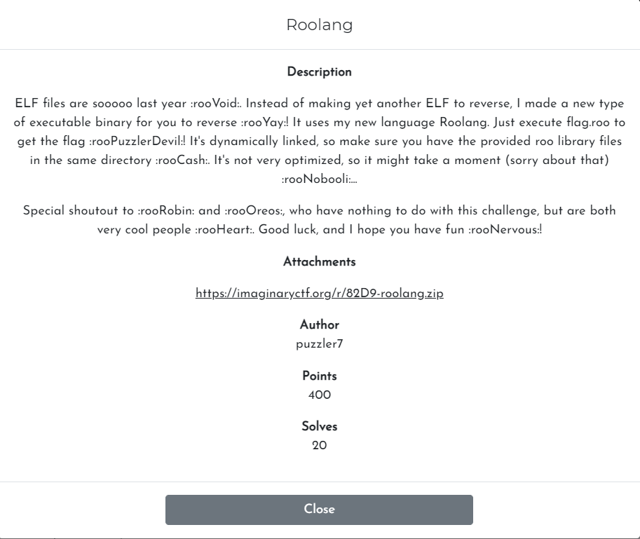

# Challenge

<p align="center">
  
</p>

# File: [roolang.zip](./roolang.zip)

# Solve:

Mình unzip file ra thì thấy có tổng cộng 7 file, có 1 file chạy được là `roolang.py`. Mình chạy thử thì kết quả trả về là `Usage: ./roolang.py [filename.roo]`. Lúc này mình nghĩ file cần thêm vào sẽ là `flag.roo` thì nó in ra flag một hồi sau đó bị đứng máy. Mình biết ngay đây là một bài tối ưu hoá thuật toán kết hợp với Virtual Machine.  
Để dễ hình dung, thì mình sẽ nói sơ về cách mình tiếp cận bài này:  
  * Để có thể theo dõi luồng hoạt động, mình đã thêm vào mỗi đoạn xử lí opcode một vài hàm print để in ra các thông tin mình cần biết, thường thì mình sẽ in ra đó là opcode gì, opcode đó sẽ làm gì, giá trị trên stack... Tuỳ vào bài mà in ra các thông tin khác nhau
  * Vì bài này là về tối ưu hoá thuật toán, nên mình suy nghĩ rằng các opcode được viết để có thể thực hiện theo một quy luật nhất định, chứ không thể nào có thể viết theo ý của tác giả được. Tới đây mình nghĩ tới việc chỉ in ra stack trong quá trình hoạt động, và in ra thông báo khi đã in ra được một kí tự trong flag, quan trọng ở đây chúng ta chỉ cần tìm ra quy luật tạo ra một kí tự trong flag, chứ không nhất thiết phải tìm hiểu từng hàm của chương trình.  
  
Với 2 suy nghĩ trên, mình liền debug cùng với chiến thuật trên. Một hồi thì minh biết được chương trình sẽ tạo ra 1 mảng giá trị, sau đó sẽ xor từng giá trị trong mảng bắt đầu từ vị trị cuối cùng với dãy số fibonacci ở vị trí tương ứng. Tới đây mình chỉ viết script và in ra kết quả:
 
## script.py 
```python
a = [0, 14472334024676096, 8944394323791450, 5527939700884769, 3416454622906725, 2111485077978096, 1304969544928756, 806515533049347, 498454011879172, 308061521170150, 190392490709200, 117669030460982, 72723460248127, 44945570212756, 27777890035307, 17167680177653, 10610209857675, 6557470319826, 4052739537835, 2504730782038, 1548008755937, 956722025992, 591286729974, 365435296253, 225851433664, 139583862488, 86267571223, 53316291075, 32951280083, 20365011165, 12586268949, 7778742098, 4807527027, 2971214979, 1836311808, 1134903217, 701408693, 433494481, 267914343, 165580035, 102334114, 63246016, 39088153, 24157707, 14930304, 9227513, 5702805, 3524541, 2178357, 1346217, 832119, 514176, 317697, 196465, 121346, 75129, 46403, 28590, 17692, 10993, 6687, 4157, 2668, 1606, 957, 534, 282, 128, 176, 42, 94, 2, 114, 108, 100, 99, 35, 103, 105, 85]

f = [1, 1, 2]

for i in range(78):
	f.append(f[i+1] + f[i+2])


for i in range(79):
	# print(f[i], a[80-i-1])
	print(chr(a[80-i-1] ^ f[i]),end="")
```

`ictf{thr33_ch33r5_t0_r00r0bin_th3_b3st_0f_u5_a11_r00h3art_7d2e2642}`