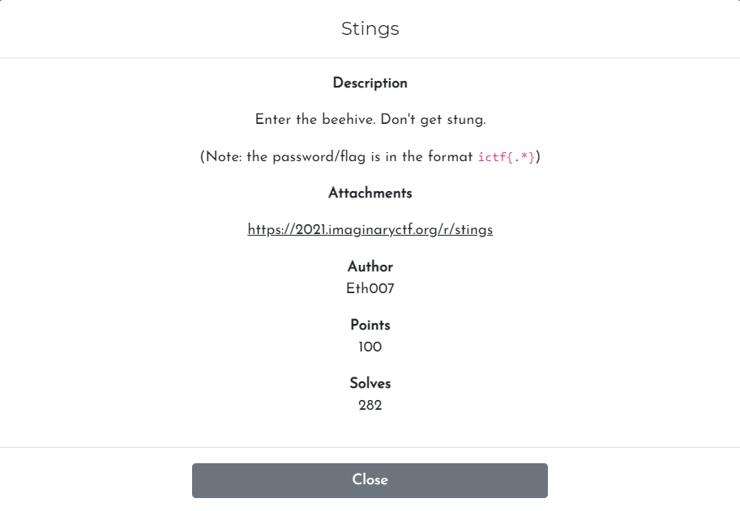
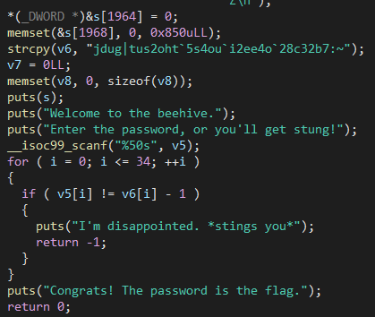

# Challenge

<p align="center">
  
</p>

# File: [stings](./stings)

# Solve:

Đưa vào IDA Pro nhìn lướt sơ:

<p align="center">
  
</p>

Nhìn vô ta liền thấy một đoạn văn bản được copy vào biến `v6`, và sau đó lấy biến `v5` là biến input từ bàn phím, so sánh với các kí từ của `v6` trừ đi 1. Mình viết script để decode `v6`:

```python
a = "jdug|tus2oht`5s4ou`i2ee4o`28c32b7:~"

for i in a:
	print(chr(ord(i) - 1), end = "")
```

`ictf{str1ngs_4r3nt_h1dd3n_17b21a69}`