# Challenge

<p align="center">
  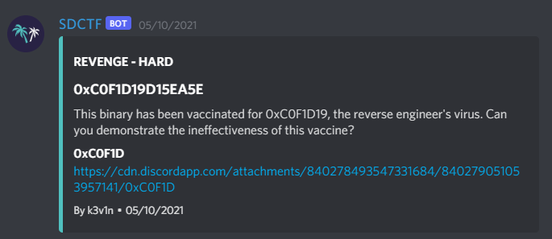
</p>

# File: [0xCOF1D](./0xCOF1D)

# Solve

```bash
nguyenguyen753@MochiZou:~/CTF/SDctf/0xC0F1D19D15EA5E$ file 0xC0F1D 
0xC0F1D: ELF 64-bit LSB shared object, x86-64, version 1 (SYSV), dynamically linked, interpreter /lib64/ld-linux-x86-64.so.2, BuildID[sha1]=7f973de2918f3c6fd2df19e4a3b751eba9ecf577, for GNU/Linux 3.2.0, stripped
```

Mở IDA xem sơ qua chương trình thử:

<p align="center">
  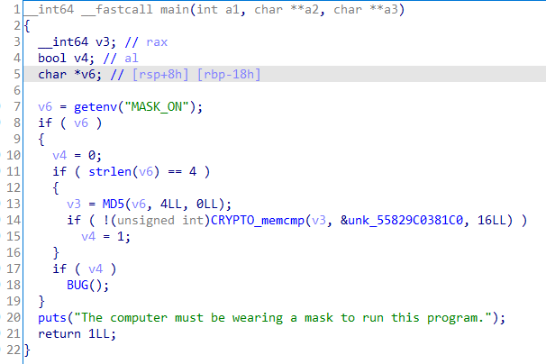
</p>

Đầu tiên hàm sẽ lấy `environment variable` tên `MASK_ON`, sau đó sẽ kiểm tra:
  - Chuỗi vừa lấy có độ dài là 4
  - Sau khi MD5 hash thì phải ra giá trị như `unk_55829C0381C0`

Vì độ dài chỉ là 4 nên mình đã bruteforce ra kết quả là `true`, vậy ta set biến:

<p align="center">
  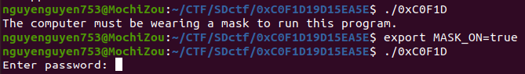
</p>

Như ta thấy thì nếu không set biến `MASK_ON=true` thì chương trình sẽ không chạy. Ta nhập thử chương trình:

<p align="center">
  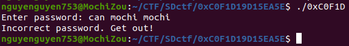
</p>

Và đương nhiên là chương trình đã kick mình đi vì mình khá xàm

Nhưng khi nhìn vào IDA, mình thấy có hàm `BUG()` rất lạ, nhấn vào thì không hiển thị gì cả. Đành phải chuyển sang Assembly để xem tiếp:

<p align="center">
  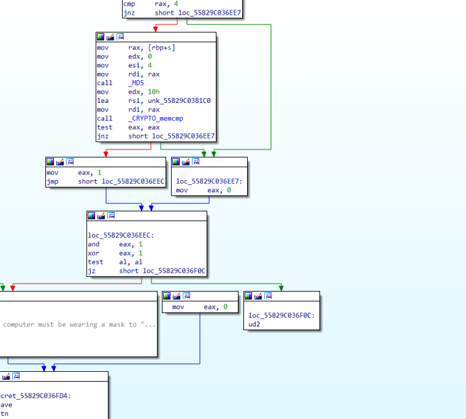
</p>

Cái hàm `BUG()` lúc nãy chình là cái `ud2` như trong hình. Lúc này mình nghi ngờ rằng đây là một cái giống `try .. catch` trong python, nghĩa là nếu có xảy ra lỗi gì ngoài ý muốn thì chương trình sẽ chuyển luồng sang chỗ khác, lúc này chỉ có cách debug thì mình mới biết chuyện gì xảy ra.

<p align="center">
  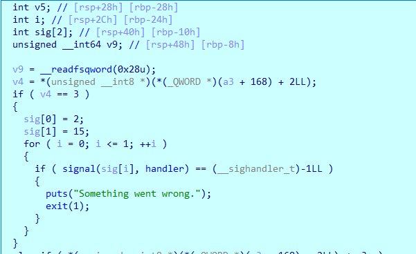
</p>

Đúng như mình nghĩ là chương trình sẽ đầy chúng ta ra một hàm khác, bây giờ mình sẽ chạy tiếp đến khi đề yêu cầu nhập Password

<p align="center">
  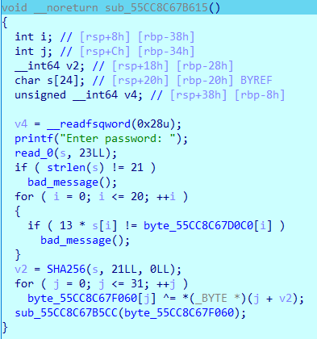
</p>

Oke, hợp lí rồi, bây giờ việc của mình là revrese đoạn chương trình này lại. Mình sẽ không trình bày chi tiết ở đây về việc thực hiện chương trình này. Mình sẽ để script đã viết để giải quyết đoạn này.

### script_antidebugger.c
```c
#include <stdio.h>

unsigned char arr[] = {20, 151, 250, 241, 59, 59, 151, 202, 215, 211, 237, 202, 151, 211, 215, 112, 211, 20, 241, 137, 250};

int main() {
	int num = 0;
	while (num != 21) {
		for (char i = 30; i<=125; i++) {
			if ((unsigned char)(i * 13) == arr[num]) {
				printf("%c", i);
				break;
			}
		}
		num++;
	}

	printf("\n");

	//result: d3bugg3rs_ar3_s0_dumb
}
```

Oke, có kết quả rồi, mình nhập vô chương trình thử xem

<p align="center">
  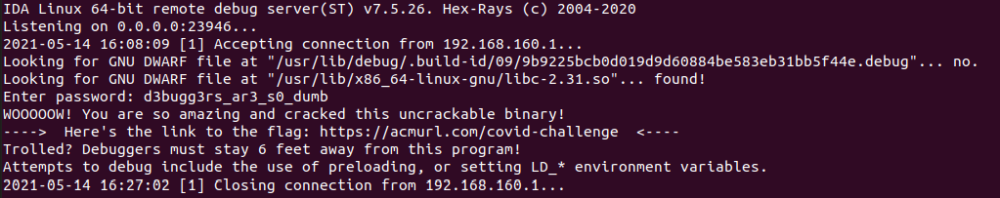
</p>

Nhấn vào link thì ra rick rolled :)
Quá cay đắng với cuộc đời, mình quyết định debug tiếp để xem coi chuyện gì đã xảy ra. Nhìn vào đoạn text ta có thể hiểu rằng là chương trình có `anti debugger`. Nhiệm vụ bây giờ mình phải tìm ra chỗ kiểm tra đó. Sau khi một hồi loay hoay thì mình đã tìm được 2 chỗ:

<p align="center">
  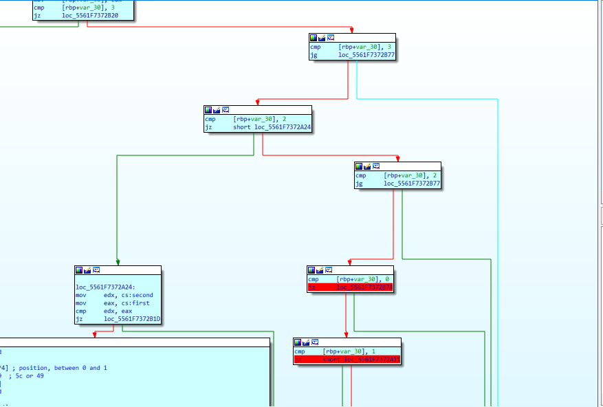
</p>

Đó là hai chỗ mình bôi đỏ. Việc của mình chỉ cần chuyển hướng 2 chỗ đó đi theo hướng ngược lại, ta sẽ ra hàm check password mới:

<p align="center">
  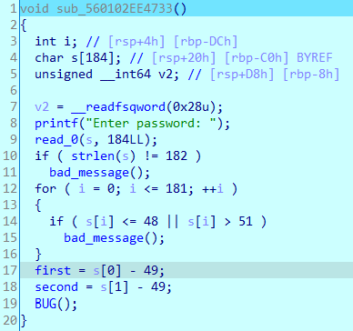
</p>

Đúng rồi đó, mình để ý có hàm `BUG()` ở phía dưới, mình sẽ chuyển sang Assembly để debug tiếp. Sau khi ngồi nghịch một thời gian thì mình phát hiện ra đây là một bài toán `Graph Traversal`, mình sẽ tóm tắt bài toán chương trình yêu cầu:
  - Cho 3 ô ban đầu, giá trị gồm `[0x5c, 0, 0]`, bạn phải biến đổi về trạng thái `[0x2e, 0x2e, 0]` bằng một vài bước biến đổi theo hình dưới đây (đoạn này mình sẽ không giải thích nhiều, các bạn thử reverse xem coi các bước biến đổi như thế nào)

<p align="center">
  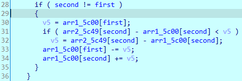
</p>

  - Password chính là các bước yêu cầu chúng ta biến đổi, vậy có nghĩa là `input` dài 182 kí tự, cứ 2 kí tự liền kề sẽ là 1 bước biến đổi, vậy có tổng cộng 91 bước biến đổi.

Thấy được những điều trên, mình đã sử dụng thuật toán BFS để giải bài này:

### script.cpp
```cpp
#include <bits/stdc++.h>

using namespace std;

struct pos {
    int fi, se;
};

struct data {
    int x, y, z;
};

int def_ar[5] = {0x5c, 0x49, 0x13}, arr[5] = {0x5c, 0, 0}, top;
bool vis[100][100][100];
pos p[10];
data pre[100][100][100];
queue < data > o;
pair < int, int > process[100][100][100], res[100];

void init() {
    p[0].fi = 0, p[0].se = 1;
    p[1].fi = 1, p[1].se = 0;
    p[2].fi = 0, p[2].se = 2;
    p[3].fi = 2, p[3].se = 0;
    p[4].fi = 1, p[4].se = 2;
    p[5].fi = 2, p[5].se = 1;
}

void findTarget() {
    o.push({0x5c, 0, 0});

    while (o.size() != 0) {
        data val = o.front();
        o.pop();

        if (vis[val.x][val.y][val.z]) continue;
        vis[val.x][val.y][val.z] = 1;
        int x = val.x, y = val.y, z = val.z;
        arr[0] = x, arr[1] = y, arr[2] = z;

//        cout << x << " " << y << " " << z << endl;

        for (int i=0; i<6; i++) {
            int v5 = min(arr[p[i].fi], def_ar[p[i].se] - arr[p[i].se]);
            arr[p[i].fi] -= v5;
            arr[p[i].se] += v5;

            if (pre[arr[0]][arr[1]][arr[2]].x + pre[arr[0]][arr[1]][arr[2]].y + pre[arr[0]][arr[1]][arr[2]].z == 0 && vis[arr[0]][arr[1]][arr[2]] == 0) {
                pre[arr[0]][arr[1]][arr[2]].x = x;
                pre[arr[0]][arr[1]][arr[2]].y = y;
                pre[arr[0]][arr[1]][arr[2]].z = z;
                process[arr[0]][arr[1]][arr[2]].first = p[i].fi;
                process[arr[0]][arr[1]][arr[2]].second = p[i].se;
            }
//            cout << arr[0] << " " << arr[1] << " " << arr[2] << endl;
            o.push({arr[0], arr[1], arr[2]});

            arr[p[i].fi] += v5;
            arr[p[i].se] -= v5;
        }
    }
}

int main() {
    init();
    findTarget();
    int arr[] = {0x2e, 0x2e, 0}, cou = 0;
//    cout << pre[92][0][0].x << " " << pre[92][0][0].y << " " << pre[92][0][0].z;
    while (pre[arr[0]][arr[1]][arr[2]].x + pre[arr[0]][arr[1]][arr[2]].y + pre[arr[0]][arr[1]][arr[2]].z != 0) {
//        cout << pre[arr[0]][arr[1]][arr[2]].x << " " << pre[arr[0]][arr[1]][arr[2]].y << " " << pre[arr[0]][arr[1]][arr[2]].z << endl;
//        cout << process[arr[0]][arr[1]][arr[2]].first << " " << process[arr[0]][arr[1]][arr[2]].second << endl;
        top++;
        res[top].first = process[arr[0]][arr[1]][arr[2]].first + 1;
        res[top].second = process[arr[0]][arr[1]][arr[2]].second + 1;
        int x = pre[arr[0]][arr[1]][arr[2]].x, y = pre[arr[0]][arr[1]][arr[2]].y, z = pre[arr[0]][arr[1]][arr[2]].z;
        arr[0] = x;
        arr[1] = y;
        arr[2] = z;
        cou++;
    }
    for (int i=top; i>=1; i--)
        cout << res[i].first << res[i].second;
    return 0;

    //result: 12233123312331231223312331233123312312233123312331233123122331233123312331231223312331233123312312233123312331233123122331233123312312233123312331233123122331233123312331231223312331
}
```

Nhập kết quả vô thì ta được:

<p align="center">
  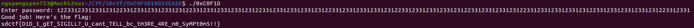
</p>

`sdctf{D1D_1_gET_SIGILL?_U_cant_TELL_bc_tH3RE_4RE_n0_SyMPt0m5!!}`


