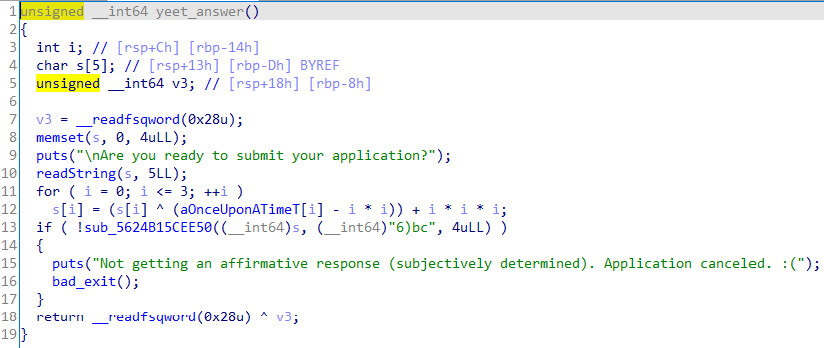

# Challenge

<p align="center">
  
</p>

# File: [chal.out](./chal.out)

# Solve

```bash
nguyenguyen753@MochiZou:~/CTF/SDctf/majorChangeApplication$ file chal.out 
chal.out: ELF 64-bit LSB shared object, x86-64, version 1 (SYSV), dynamically linked, interpreter /lib64/ld-linux-x86-64.so.2, BuildID[sha1]=ff7b32de7bd4e27a30cd2e490bd2bbc32d568e1e, for GNU/Linux 3.2.0, stripped
```

Vô IDA xem thử:

<p align="center">
  
</p>

Mình đã vô từng hàm và đổi tên lại cho dễ hiểu:

<p align="center">
  
</p>

Hàm `createRandSeed()`, đây sẽ là hàm khá quan trọng ở đoạn sau.

<p align="center">
  
</p>

Hàm `inputName()`, hàm sẽ yêu cầu nhập vào họ và tên, khá đơn giản.

<p align="center">
  
</p>

Tiếp theo là hàm `inputID()`

<p align="center">
  
</p>

Hàm `inputID()`, bắt đầu tới hàm mình cần quan tâm tới. Nhìn sơ qua thì hàm yêu cầu một vài thứ:
  - ID phải có kí tự `H` ở đầu
  - Tiếp theo đó sẽ là 8 chữ số bất kì, ví dụ: `H12345678`
  - Số trong ID phải được tạo ra dựa trên họ và tên bằng cách tạo seeds theo các kí tự trong họ tên, sau đó lây random số đầu tiên:

<p align="center">
  
</p>

<p align="center">
  
</p>

Hàm `yeet_answer`:

<p align="center">
  
</p>

Dễ thầy hàm sẽ yêu cầu ta nhập vào 1 chuỗi có 4 kí tự, sau khi decode ra thì câu trả lời là `yeet`.  
  
Chúng ta tới hàm quan trọng nhất: `check()`

<p align="center">
  
</p>

Xem thử hàm `sub_5624B15CEB02()`

<p align="center">
  
</p>

Mình đã debug trước đoạn này nên mình đã đặt tên một vài hàm cho dễ nhớ.  
Khi đã nhìn ra được vấn đề bài toán là chúng ta phải tìm tên nào đó, mà khi tạo ra được `v4` thì phải thoả điều kiện `v4 <= 9`. Khi đấy ta sẽ nghĩ đến việc tạo một cái tên sau cho `v1 = keyValue` với `keyValue` như trong hàm `createRandSeed()`. Tới đây mình sẽ viết script. Do mình không biết socket programming trên c++, nên mình đã kết hợp c, c++ và python để làm ra bài này, khá rườm rà =((

### time.c
```c
#include <stdio.h>
#include <time.h>

int main() {
	long long result = (unsigned long long)time(0LL) >> 2;
  	printf("%lld\n", result);
}
```

### createName.cpp
```cpp
#include <bits/stdc++.h>

using namespace std;

int64_t special_name_hash(string s) {
    int64_t hash = 0xc0de5bad13375eed;

    for (int i = 0; i < s.length(); i++) {
        hash = hash * 0x1f + s[i];
    }

    return hash;
}

int64_t id(string s) {
    int64_t hash = 0;

    for (int i = 0; i < s.length(); i++) {
        hash = hash * 31 + s[i];
    }

    srand(hash);
    return rand() % 100000000;
}

int main() {
	long long val;
	cin >> val;
	int64_t v1 = 0xc0de5bad13375eed;
	string s = "";

	val -= (long long)((long long) 0xAEE5720EE830681 * (long long) v1);
	
	for (int i=0; i<12; i++) {
		long long Pow = 1;
		for (int j=0; j<(11 - i); j++)
			Pow *= (long long)31;

		long long u = val / Pow;

		val -= u * Pow;
		s += (char)u;
	}

	cout << s << " " << id(s);
}
```

### script.py
```python
from pwn import *
import os

p = process('./time');
targetSeeds = p.recv()
p.close()
print(targetSeeds)

p = process('./createName');
p.sendline(targetSeeds)
data = p.recv()
name = data.split(b' ')[0]
idstudent = b'H' + data.split(b' ')[1]
p.close()

p = remote('major.sdc.tf', 1337)
print(p.recv())
ans = name[6:] + b" " + name[:6]
p.sendline(ans)

print(p.recv())
p.sendline(idstudent)

print(p.recv())
p.sendline('yeet')

print(p.recv())
print(p.recv())
```

# Result
<p align="center">
  
</p>

`sdctf{I_f1nally_h@v3_@ccess_t0_Upp3r_d1v_c0ur535}`