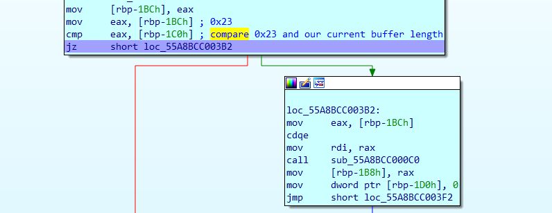
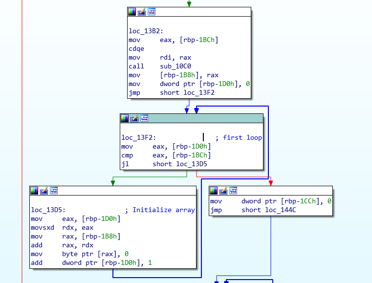
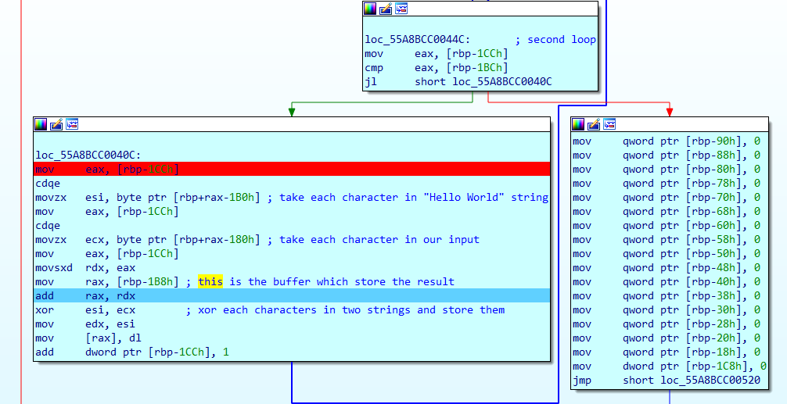
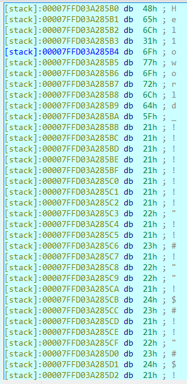
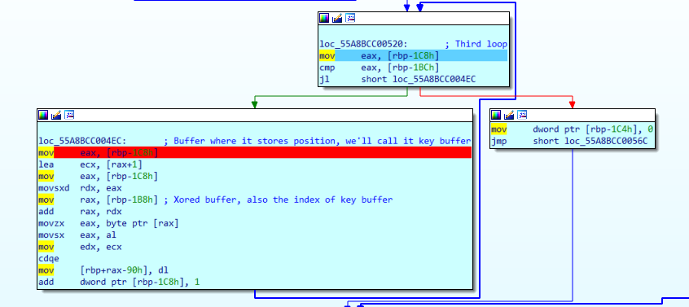
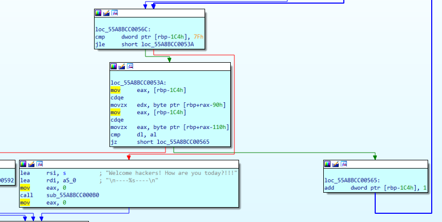

# Đề bài:

[easy_chall-2](https://drive.google.com/file/d/1nZyVmcxhb5V-CbrUBK3ekEYhdSmzHAuG/view?usp=sharing)

# Cách giải:

```bash
$ file easy_chall-2 
easychall: ELF 64-bit LSB pie executable, x86-64, version 1 (SYSV), dynamically linked, interpreter /lib64/ld-linux-x86-64.so.2, BuildID[sha1]=f020f6f822ef43366d88b9ff122324885ea7861f, for GNU/Linux 3.2.0, not stripped
```

Mình xài ghidra để decompile và đọc code thử:

```C++
undefined8 main(void)

{
  int iVar1;
  size_t sVar2;
  size_t sVar3;
  undefined8 uVar4;
  void *pvVar5;
  long in_FS_OFFSET;
  int local_1d8;
  int local_1d4;
  int local_1d0;
  int local_1cc;
  undefined8 local_1b8;
  undefined8 local_1b0;
  undefined8 local_1a8;
  undefined8 local_1a0;
  undefined2 local_198;
  undefined local_196;
  byte local_188 [112];
  undefined8 local_118;
  undefined8 local_110;
  undefined8 local_108;
  undefined8 local_100;
  undefined8 local_f8;
  undefined8 local_f0;
  undefined8 local_e8;
  undefined8 local_e0;
  undefined8 local_d8;
  undefined8 local_d0;
  undefined8 local_c8;
  undefined8 local_c0;
  undefined8 local_b8;
  undefined8 local_b0;
  undefined8 local_a8;
  undefined8 local_a0;
  undefined8 local_98;
  undefined8 local_90;
  undefined8 local_88;
  undefined8 local_80;
  undefined8 local_78;
  undefined8 local_70;
  undefined8 local_68;
  undefined8 local_60;
  undefined8 local_58;
  undefined8 local_50;
  undefined8 local_48;
  undefined8 local_40;
  undefined8 local_38;
  undefined8 local_30;
  undefined8 local_28;
  undefined8 local_20;
  long local_10;
  
  local_10 = *(long *)(in_FS_OFFSET + 0x28);
  local_118 = 0x220020210011;
  local_110 = 0x90003000a070200;
  local_108 = 0x500000000;
  local_100 = 0x8000000000000;
  local_f8 = 6;
  local_f0 = 0x1000000000000;
  local_e8 = 0xb0000;
  local_e0 = 0;
  local_d8 = 0x19001d0c0e000000;
  local_d0 = 0x1f10000000000015;
  local_c8 = 0x1804001e0f16001a;
  local_c0 = 0x230000001b;
  local_b8 = 0x1300000000;
  local_b0 = 0;
  local_a8 = 0x12000000;
  local_a0 = 0xd14171c000000;
  local_1b8 = 0x726f776f316c6548;
  local_1b0 = 0x21212121215f646c;
  local_1a8 = 0x2123212122212121;
  local_1a0 = 0x2221212324212222;
  local_198 = 0x2423;
  local_196 = 0x21;
  printf("Enter input: ");
  __isoc99_scanf(&DAT_00102012);
  sVar2 = strlen((char *)local_188);
  sVar3 = strlen((char *)&local_1b8);
  iVar1 = (int)sVar3;
  if (iVar1 == (int)sVar2) {
    pvVar5 = malloc((long)iVar1);
    local_1d8 = 0;
    while (local_1d8 < iVar1) {
      *(undefined *)((long)pvVar5 + (long)local_1d8) = 0;
      local_1d8 = local_1d8 + 1;
    }
    local_1d4 = 0;
    while (local_1d4 < iVar1) {
      *(byte *)((long)pvVar5 + (long)local_1d4) =
           *(byte *)((long)&local_1b8 + (long)local_1d4) ^ local_188[local_1d4];
      local_1d4 = local_1d4 + 1;
    }
    local_98 = 0;
    local_90 = 0;
    local_88 = 0;
    local_80 = 0;
    local_78 = 0;
    local_70 = 0;
    local_68 = 0;
    local_60 = 0;
    local_58 = 0;
    local_50 = 0;
    local_48 = 0;
    local_40 = 0;
    local_38 = 0;
    local_30 = 0;
    local_28 = 0;
    local_20 = 0;
    local_1d0 = 0;
    while (local_1d0 < iVar1) {
      *(char *)((long)&local_98 + (long)(int)*(char *)((long)pvVar5 + (long)local_1d0)) =
           (char)local_1d0 + '\x01';
      local_1d0 = local_1d0 + 1;
    }
    local_1cc = 0;
    while (local_1cc < 0x80) {
      if (*(char *)((long)&local_98 + (long)local_1cc) !=
          *(char *)((long)&local_118 + (long)local_1cc)) {
        uVar4 = 0xffffffff;
        goto LAB_00101592;
      }
      local_1cc = local_1cc + 1;
    }
    printf("\n----%s----\n",s);
    uVar4 = 0;
  }
  else {
    uVar4 = 0xffffffff;
  }
LAB_00101592:
  if (local_10 != *(long *)(in_FS_OFFSET + 0x28)) {
                    /* WARNING: Subroutine does not return */
    __stack_chk_fail();
  }
  return uVar4;
}
```

Chỉ việc nhìn sơ qua, chúng ta không có nhiều thông tin, nên lần này sẽ debug bằng IDA:



Điều kiện đầu tiên yêu câu độ dài buffer phải bằng 0x23, tức là 35. Vậy ta có thể đoán flag sẽ có độ dài là 35.
Ta có 2 cách để bypass điều kiện này:
  - Cách thứ nhất: chúng ta có thể để input có độ dài là 35.
  - Cách thứ hai: khi debug, chúng ta có thể set `zero flag = 1`, để chương trình hiểu rằng chúng ta có buffer có độ dài là 35

Tiếp tục debug:



Vòng for đầu tiên để khởi tạo mảng



Vòng for thứ hai sẽ Xor 2 chuỗi `Hello World` và chuỗi `Input` cho chúng ta.



Đây là chuỗi `Hello World`

Tiếp tục debug:



Đây là phần quan trọng của chương trình, đoạn này sẽ lấy các kết quả sau khi Xor được từ 2 chuỗi, làm index cho `key buffer` và gán cho `key buffer` các giá trị từ 1 đến 35



Đoạn này sẽ kiểm tra kết quả với mảng tại giá trị `[rbp+rax-110h]`. Sau khi debug xong, ta vẽ viết script để tìm flag:


### script.py
```python
strings = 'Hel1oworld_!!!!!!!!\"!!#!\"\"!$#!!\"#$!'
f = open('abc', 'r')
leak = f.readlines()	#Leak chính là mảng tại địa chỉ [rbp+rax-110h]
a = []
res = []
for i in range(35):
	res.append(0)

for i in leak:
	k = i[29:32].strip()
	if k[len(k) - 1] == 'h':
		k = '0x' + k[:-1]
	a.append(int(k, 16))

for i in range(len(a)):
	if a[i] != 0:
		pos = a[i] - 1
		res[pos] = ord(strings[pos]) ^ i

for i in res:
	print(chr(i), end = "")
```

`Flag: flag{Welcome_bro!RE_is_very_fun!!!}`


