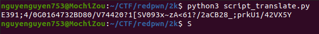

# Challenge

  

# File: [chall](./chall)    [prog.bin](./prog.bin)

# Solve:
Chỉ cần nhìn vào đề bài là mình đoán được ngay đây là một bài virtual machine obfuscation. Nhiêm vụ duy nhất của chúng ta chỉ là debug một cách lì lợm để hiểu chương trình và viết script dịch opcodes. WriteUp bài này mình chỉ tóm gọn một vài chỗ đặc biệt trong chương trình.

  

Đây là nơi mọi thư bắt đầu. Chương trình sẽ dịch từ opcodes trong file `prog.bin` thành một đoạn chương trình.  
Theo như mình debug thì chương trình có tổng cộng 21 hàm tương ứng 21 opcodes. Mình viết một đoạn script nhỏ [vm_parser.py](./Script/vm_parser.py) để mô tả lại các dãy opcodes trong file `prog.bin`  
Khi debug một lúc thì mình phát hiện đây chỉ là một bài tìm input thoả mãn "rất nhiều" điều kiện. Vì thế mình sẽ xài z3 solver để giải bài này.  
Mình viết thêm 2 script [z3_solver.py](./Script/z3_solver.py) để tìm input và [script_translate.py](./Script/script_translate.py) để in ra input đó. Thì ta có kết quả:

  

Gửi lên server:

  

`flag{kenken_is_just_z3_064c4}`