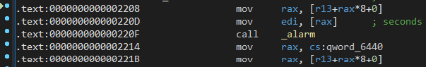

# Challenge

<p align="center">
  
</p>

# File: [wstrings](./wstrings)

# Solve:

```bash
nguyenguyen753@MochiZou:~/CTF/redpwn/bread-making$ file bread 
bread: ELF 64-bit LSB shared object, x86-64, version 1 (SYSV), dynamically linked, interpreter /lib64/ld-linux-x86-64.so.2, BuildID[sha1]=bc53c3fba45513551ddde163ba9a41e3f6dbab7b, for GNU/Linux 3.2.0, stripped
```

Bỏ vào IDA xem thử thì đoạn code này làm mình chú ý đầu tiên:

<p align="center">
  
</p>

Mình xem thử hàm `sub_25C0()`:

<p align="center">
  
</p>

À, đây là hàm mình cần đi tới, mình sẽ đặt tên hàm này lại là `goodMessage()`.
Ngoài ra, để đi đến để hàm này thì 5 biến trong các điều kiện if phải khác 0 hết. Mình sẽ lần lượt đặt các biến đó thành check1 ... check5:

<p align="center">
  
</p>

Mình còn có 1 đoạn code nhỏ ở phía trên của chương trình: 

<p align="center">
  
</p>

<p align="center">
  
</p>

Ta có thể đoán được ngay đây là đoạn chương trình để kiểm tra điều kiện.
Để ý kĩ thì ta có hàm `alarm()` và hàm `signal()`. Hàm `alarm(t)` có vai trò trong việc gửi signal cho `process` sau một khoảng thời gian `t` giây, ở đây `alarm()` sẽ gửi `SIGALRM`. Còn hàm `signal(sig, sub)` sẽ thực hiện chương trình `sub` nếu như nhận được tín hiệu `sig` từ chương trình.
Chương trình sử dụng lệnh `signal(14, handler)`, `14` là `SIGALRM`, vậy nghĩa là hàm `handler` sẽ được kích hoạt sau `t` giây. nhìn vô hàm `handler`:

<p align="center">
  
</p>

Đơn thuần chỉ là thoát chương trình.
Ta có thể kết luận đây là một cơ chế anti-debugger. Để bypass đoạn này khi debug thì ta sẽ patch hàm `alarm()` lại thành các lệnh `nop` như sau:

<p align="center">
  
</p>

<p align="center">
  
</p>

Tới đây ta có thể debug để tìm hiểu chương trình.
Sau một hồi debug thì mình thấy rằng chương trình có tổng cộng 11 câu hỏi, và ta phải trả lời đúng hết 11 câu hỏi đó thì 5 biến `check` sẽ được bật lên thành bit 1, từ đó ta sẽ có được flag.
Tới đây mình xài `pwntool` để viết client-script để gửi lên server, đoạn chương trình như sau:

## script.py

```python
from pwn import *

r = remote("mc.ax", 31796)

#stage 1
print(r.recv())
r.sendline("add flour")
print(r.recv())
r.sendline("add yeast")
print(r.recv())
r.sendline("add salt")
print(r.recv())
r.sendline("add water")

#stage 2
print(r.recv())
print(r.recvuntil(b'lumpy dough\n'))
r.sendline("hide the bowl inside a box")
print(r.recv())

#stage 3
print(r.recvuntil(b'rise\n'))
r.sendline(b'wait 3 hours')
print(r.recvuntil(b'risen'))

#stage 4
print(r.recvuntil(b'dough\n'))
r.sendline(b'work in the basement')
print(r.recvuntil('tray'))

#stage 5
print(r.recvuntil(b'baked\n'))
r.sendline('preheat the toaster oven')
print(r.recvuntil(b'orange'))

#stage 6
print(r.recvuntil(b'minutes\n'))
r.sendline('set a timer on your phone')
print(r.recvuntil(b'down'))

#stage 7
print(r.recvuntil(b'time\n'))
r.sendline('watch the bread bake')
print(r.recvuntil(b'fire'))

#stage 8
print(r.recvuntil(b'waste\n'))
r.sendline('pull the tray out with a towel')
print(r.recvuntil(b'sink'))

#stage 9
print(r.recvuntil(b'air\n'))
r.sendline('unplug the oven')
print(r.recv())
r.sendline('unplug the fire alarm')
print(r.recv())
r.sendline('open the window')
print(r.recv())

#stage 10
r.sendline('wash the sink')
print(r.recv())
r.sendline('clean the counters')
print(r.recv())
r.sendline('flush the bread down the toilet')
print(r.recvuntil(b'of\n'))
r.sendline('get ready to sleep')
print(r.recv())

#final stage
r.sendline('close the window')
print(r.recv())
r.sendline('replace the fire alarm')
print(r.recvuntil(b'replaced\n'))
r.sendline('brush teeth and go to bed')
print(r.recv())

print(r.recv())
```

Chạy chương trình để lấy flag:

<p align="center">
  
</p>

`flag{m4yb3_try_f0ccac1a_n3xt_t1m3???0r_dont_b4k3_br3ad_at_m1dnight}`