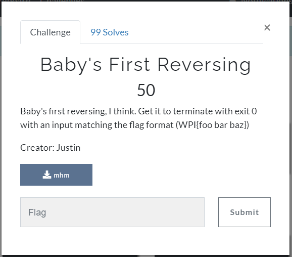

# Challenge

<p align="center">
  
</p>

# Solution

```bash
┌──(nguyenguyen753㉿kali)-[~/CTF/wpictf/baby'sFirstReversing]
└─$ file mhm 
mhm: python 3.8 byte-compiled
```

Ở đây mình xài decompyle3 để decompile file, ta sẽ chuyển file `mhm` thành `mhm.pyc` rồi decompile:

```bash
mochi@mochi-ZenBook-UX425IA-UM425IA:~/Downloads$ decompyle3 mhm.pyc 
# decompyle3 version 3.3.2
# Python bytecode 3.8 (3413)
# Decompiled from: Python 3.8.5 (default, Jan 27 2021, 15:41:15) 
# [GCC 9.3.0]
# Embedded file name: uhhhhhhh.py
# Compiled at: 2021-03-05 06:04:38
# Size of source mod 2**32: 1222 bytes

def __main__(inp):
    i = -4
    for c in inp:
        if i == 4:
            if c != ' ':
                exit(82)
        if i == -4:
            if c != 'W':
                exit(133)
        if i == -2:
            if c != 'I':
                exit(42069)
        if i == -1:
            if c != '{':
                exit(11037)
        if i == 10:
            if c != '}':
                exit(9001)
        if i == 1:
            if c != '@':
                exit(11037)
        if i == 2:
            if c != '5':
                exit(11037)
        if i == 7:
            if c != 'P':
                exit(11037)
        if i == 3:
            if c != 'E':
                exit(11037)
        if i == 0:
            if c != 'h':
                exit(82)
        if i == 5:
            if c != 'h':
                exit(11037)
        if i == -3:
            if c != 'P':
                exit(133)
        if i == 9:
            if c != '!':
                exit(133)
        if i == 6:
            if c != '0':
                exit(133)
        if i == 8:
            if c != '3':
                exit(133)
        i += 1
    else:
        print(':)')


__main__(input('hi'))
# okay decompiling mhm.pyc
```

Sắp xếp các kí tự, ta được kết quả:

`WPI{h@5E h0P3!}`