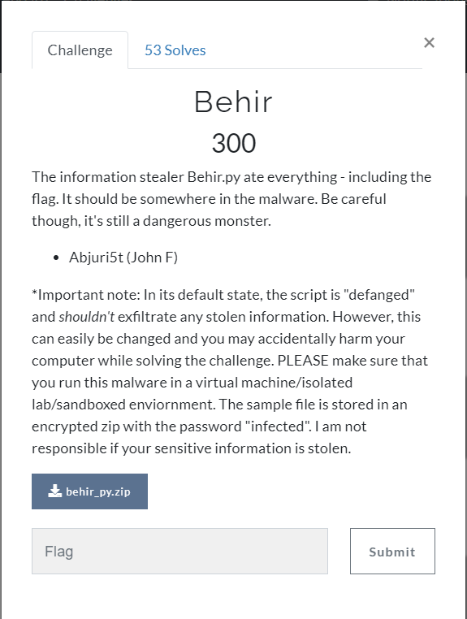
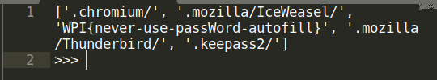

# Challenge

<p align="center">
  
</p>

# File: [behir.py](./behir.py)

# Solution

Một bài malware (này là do đề kêu, chứ cũng không cao siêu tới nỗi được gọi là malware đâu) viết bằng python, chúng ta xem sơ qua chương trình thì có vẻ code đã obfuscate, mình ngồi chạy từng đoạn chương trình cộng thêm deobfuscate thì phát hiện đâu đó trong một đoạn chương trình khá nhỏ:

```python
def main():
    ranger = int(time.time())
    # if(str(hashlib.md5(open(__file__, "rb").read()[43:]).hexdigest()) == tressym):
    ether = -1
    crawlingclaw = "who" + "ima"[::ether]
    ether = ether + 1
    owlbear = os.popen(crawlingclaw).read().split('\n')[ether]
    lightning[ether] = lightning[ether] + "iu" + lightning[ether][ether -1] + adventure
    pi = "PI.3.14159265"
    yeti = "pass"
    ether = ether + 1
    ancestral = makesoul(yeti)
    arcane = "_info.log"
    ancestral[ether] = chr(123) + 'n' + makesoul(yeti)[ether].split('n')[ether]
    gold = "stolen" + arcane
    ancestral[ether] = 'w' + pi.split('.')[ether - ether] + ancestral[ether]
    gold = gold.replace('_', '-')
    for torrent in ancestral:
        lightning.append(torrent)
    ether = ether - ether
    lightning.append(".kee" + yeti + '2' + adventure)
    for fire in range(len(lightning)):
        lightning[fire] = lightning[fire].replace('_', '-')
        lightning[fire] = lightning[fire].replace('w', 'W')
    
    #========= FLAG IN HERE ===========
    print(lightning)
    #==================================

        # bludgeoning = int(time.time())
        # if(bludgeoning - ranger <= 2):
        #     evocation = len(lightning)
        #     for castle in range(evocation): #Ya the ".keepass2/" one is ambitious... but I have seen malware do this
        #         devour(lightning[castle], owlbear, gold)
        #     for aboleth in range(evocation):
        #         lightning.pop(ether)
        #     circle("WPI")
```

Ở đây mình đã chạy thử những hàm khác, và mình thấy rằng những hàm khác không có gì quan trọng cả, nhưng khi in ra những biến mình nghi ngờ thì đoạn `FLAG IN HERE` chính là đoạn chứa flag:

<p align="center">
  
</p>

`WPI{never-use-passWord-autofill}`